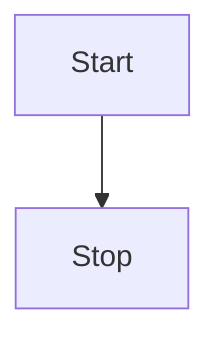

# Markdown 语法速查


## 基本语法

> 大部分编辑器都支持的基本语法

### 标题

```markdown
# 一级标题

## 二级标题

## 三级标题
```

### 段落

```markdown
这是一段文字

这是另一段文字
```

### 换行

```markdown
第一行

第二行

或者

第一行<br>
第二行
```

### 强调

```markdown
**粗体**
_斜体_
**_粗斜体_**
~~删除线~~
```

### 引用

```markdown
> 引用的一段话
>
> 引用
```

### 列表

```markdown
有序列表:

1. 苹果
2. 香蕉
3. 橘子
   1. 红色火龙果
   2. 白色火龙果
4. 梨子

无序列表:

- 张三
- 李四
- 王五
  - 一
  - 二
  - 三
- ...
```

### 代码块

````markdown
`console.log('hello')`

```js
const str = 'hello'
console.log(str)
```
````

### 分割线

```markdown
上面的文字

---

下面的文字
```

### 链接

```markdown
一般链接:
[Markdown 语法](https://markdown.com.cn "链接标题")

简易链接:
<https://markdown.com.cn>
<fake@example.com>

格式化链接:
加粗文字 **[EFF](https://eff.org)**.
斜体字 _[Markdown Guide](https://www.markdownguide.org)_.
代码块 [`code`](#code).
```

### 图片

```markdown


可点击的图片:
[](链接)
```

### 转义字符

```markdown
\*
```

## 扩展语法

> 扩展语法并不是所有编辑器都支持

### 表格

| 左对齐    |    居中     |      右对齐 |
| :-------- | :---------: | ----------: |
| Header    |    Title    | Here's this |
| Paragraph | Text &#124; |    And more |

```markdown
| 左对齐    |    居中     |      右对齐 |
| :-------- | :---------: | ----------: |
| Header    |    Title    | Here's this |
| Paragraph | Text &#124; |    And more |
```

[Markdown 在线表格生成器](https://www.tablesgenerator.com/markdown_tables)

### 任务列表

- [x] Write the press release
- [ ] Update the website
- [ ] Contact the media

``` markdown
- [x] Write the press release
- [ ] Update the website
- [ ] Contact the media
```

### latex

$\pi = 3.14159$

$$
\pi = 3.14159
$$

```markdown
$\pi = 3.14159$

$$
\pi = 3.14159
$$
```

### mermaid



````markdown

````
