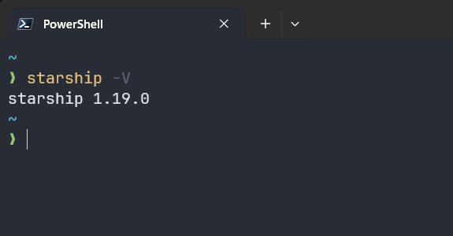

# Starship 安装配置



## 配置文件

配置文件位置: `~/.config/starship.toml`

### 本地终端配置

```toml
"$schema" = 'https://starship.rs/config-schema.json'

add_newline = false

format = """
[](#9A348E)\
$os$hostname\
[](bg:#DA627D fg:#9A348E)\
$directory\
[](fg:#DA627D bg:#FCA17D)\
$git_branch\
$git_status\
[](fg:#FCA17D bg:#86BBD8)\
$c$elixir$elm$golang$gradle$haskell$java$julia$nodejs$nim$rust$scala\
[](fg:#86BBD8 bg:#06969A)\
$docker_context\
[](fg:#06969A bg:#33658A)\
$time\
[ ](fg:#33658A)\
$line_break\
$username$character"""

[aws]
format = '[ $symbol($profile)(\($region\))($duration )]($style)'
symbol = "  "

[bun]
format = '[ $symbol($version)]($style)'

[buf]
format = '[ $symbol($version(-$name))]($style)'
symbol = " "

[c]
style = "bg:#86BBD8 white"
format = '[ $symbol($version(-$name))]($style)'
symbol = " "

[character]
success_symbol = '[➜](bold green)'
error_symbol = '[➜](bold red)'

[cmake]
format = '[ $symbol($version)]($style)'

[conda]
format = '[ $symbol$environment]($style)'
symbol = " "

[cmd_duration]
format = '[  $duration]($style)'

[cobol]
format = '[ $symbol($version)]($style)'

[crystal]
format = '[ $symbol($version)]($style)'

[daml]
format = '[ $symbol($version)]($style)'

[dart]
format = '[ $symbol($version)]($style)'
symbol = " "

[deno]
format = '[ $symbol($version)]($style)'

[directory]
style = "bg:#DA627D white"
format = "[ $path$read_only ]($style)"
truncation_length = 3
truncation_symbol = "…/"
read_only = " "

[directory.substitutions]
"~" = ""
"repos" = "󰳏"
"Desktop" = ""
"Documents" = "󰈙"
"Downloads" = ""
"Music" = ""
"Videos" = ""
"Pictures" = ""

[docker_context]
style = "bg:#06969A white"
format = '[ $symbol$context]($style)'
symbol = " "

[dotnet]
format = '[ $symbol($version)(🎯 $tfm)]($style)'

[elixir]
style = "bg:#86BBD8"
format = '[ $symbol($version \(OTP $otp_version\))]($style)'
symbol = " "

[elm]
style = "bg:#86BBD8 white"
format = '[ $symbol($version)]($style)'
symbol = " "

[erlang]
format = '[ $symbol($version)]($style)'

[gcloud]
format = '[ $symbol$account(@$domain)(\($region\))]($style)'

[git_branch]
style = "bg:#FCA17D white"
format = '[ $symbol$branch]($style)'
symbol = " "

[git_status]
style = "bg:#FCA17D white"
format = '[ $all_status$ahead_behind ]($style)'

[golang]
style = "bg:#86BBD8 white"
format = '[ $symbol($version) ]($style)'
symbol = " "

[gradle]
style = "bg:#86BBD8 white"
format = '[  $symbol ($version) ]($style)'

[haskell]
style = "bg:#86BBD8 white"
format = '[ $symbol($version)]($style)'
symbol = " "

[helm]
format = '[ $symbol($version)]($style)'

[hg_branch]
format = '[ $symbol$branch]($style)'
symbol = " "

[hostname]
ssh_only = false
format = '[ $hostname ](bg:#9A348E white)'
disabled = false

[java]
style = "bg:#86BBD8 white"
format = '[ $symbol($version)]($style)'
symbol = " "

[julia]
style = "bg:#86BBD8 white"
format = '[ $symbol($version)]($style)'
symbol = " "

[kotlin]
format = '[ $symbol($version)]($style)'

[kubernetes]
format = '[ $symbol$context( \($namespace\))]($style)'

[lua]
format = '[ $symbol($version)]($style)'

[memory_usage]
format = '$symbol[$ram( | $swap)]($style)'
symbol = " "

[nim]
style = "bg:#86BBD8 white"
format = '[ $symbol($version)]($style)'
symbol = " "

[nix_shell]
format = '[ $symbol$state( \($name\))]($style)'
symbol = " "

[nodejs]
style = "bg:#86BBD8 white"
format = '[ $symbol($version) ]($style)'
symbol = " "

[ocaml]
format = '[ $symbol($version)(\($switch_indicator$switch_name\))]($style)'

[openstack]
format = '[ $symbol$cloud(\($project\))]($style)'

[os]
style = 'bg:#9A348E white'
disabled = false

[os.symbols]
Windows = ""
Debian = "󰣚"

[package]
format = '[ $symbol$version]($style)'
symbol = " "

[perl]
format = '[ $symbol($version)]($style)'

[php]
format = '[ $symbol($version)]($style)'

[pulumi]
format = '[ $symbol$stack]($style)'

[purescript]
format = '[ $symbol($version)]($style)'

[python]
format = '[ ${symbol}${pyenv_prefix}(${version})(\($virtualenv\))]($style)'
symbol = " "

[raku]
format = '[ $symbol($version-$vm_version)]($style)'

[red]
format = '[ $symbol($version)]($style)'

[ruby]
format = '[ $symbol($version)]($style)'

[rust]
style = "bg:#86BBD8 white"
format = '[ $symbol($version)]($style)'
symbol = " "

[scala]
style = "bg:#86BBD8 white"
format = '[ $symbol($version)]($style)'

[spack]
format = '[ $symbol$environment]($style)'
symbol = "🅢 "

[sudo]
format = '[ as $symbol] '

[swift]
format = '[ $symbol($version)]($style)'

[terraform]
format = '[ $symbol$workspace]($style)'

[time]
disabled = false
time_format = "%T"
style = "bg:#33658A white"
format = '[ $time ]($style)'

[username]
show_always = true
format = '[$user ]($style)'
disabled = false

[vagrant]
format = '[ $symbol($version)]($style)'

[vlang]
format = '[ $symbol($version)]($style)'

[zig]
format = '[ $symbol($version)]($style)'
```

### 服务终端配置

```toml
"$schema" = 'https://starship.rs/config-schema.json'
add_newline = false

[character]
success_symbol = "[>](bold green)"
error_symbol = "[x](bold red)"
vicmd_symbol = "[<](bold green)"

[git_commit]
tag_symbol = " tag "

[git_status]
ahead = ">"
behind = "<"
diverged = "<>"
renamed = "r"
deleted = "x"

[aws]
symbol = "aws "

[bun]
symbol = "bun "

[c]
symbol = "C "

[cobol]
symbol = "cobol "

[conda]
symbol = "conda "

[crystal]
symbol = "cr "

[cmake]
symbol = "cmake "

[daml]
symbol = "daml "

[dart]
symbol = "dart "

[deno]
symbol = "deno "

[dotnet]
symbol = ".NET "

[directory]
read_only = " ro"

[docker_context]
symbol = "docker "

[elixir]
symbol = "exs "

[elm]
symbol = "elm "

[git_branch]
symbol = "git "

[golang]
symbol = "go "

[hg_branch]
symbol = "hg "

[java]
symbol = "java "

[julia]
symbol = "jl "

[kotlin]
symbol = "kt "

[lua]
symbol = "lua "

[nodejs]
symbol = "nodejs "

[memory_usage]
symbol = "memory "

[nim]
symbol = "nim "

[nix_shell]
symbol = "nix "

[ocaml]
symbol = "ml "

[package]
symbol = "pkg "

[perl]
symbol = "pl "

[php]
symbol = "php "

[pulumi]
symbol = "pulumi "

[purescript]
symbol = "purs "

[python]
symbol = "py "

[raku]
symbol = "raku "

[ruby]
symbol = "rb "

[rust]
symbol = "rs "

[scala]
symbol = "scala "

[spack]
symbol = "spack "

[sudo]
symbol = "sudo "

[swift]
symbol = "swift "

[terraform]
symbol = "terraform "

[zig]
symbol = "zig "
```

施工中...
