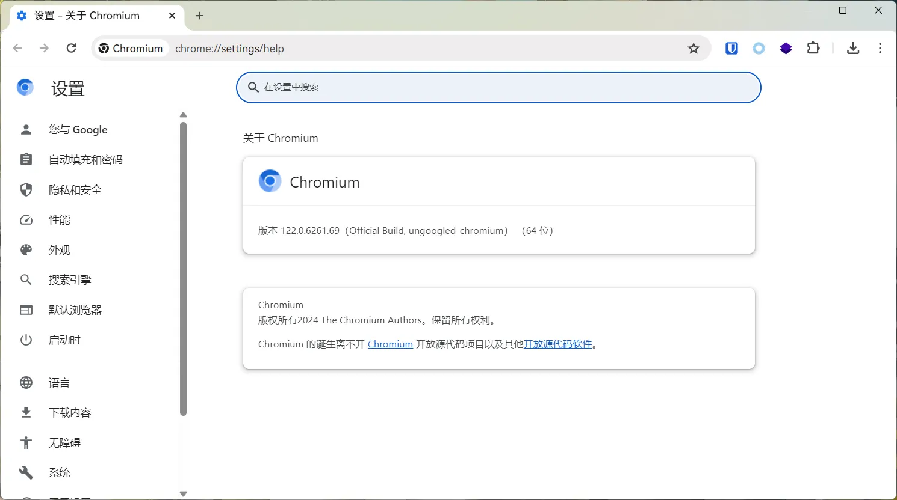
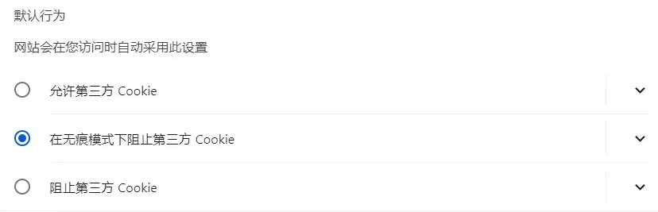
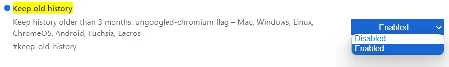
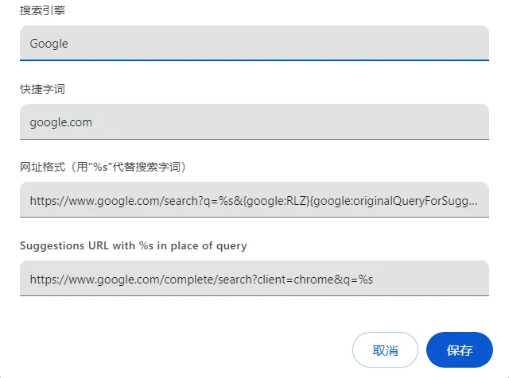
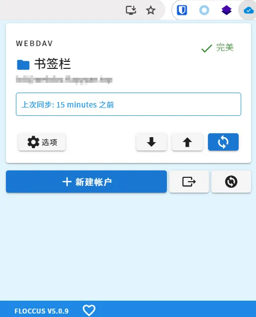
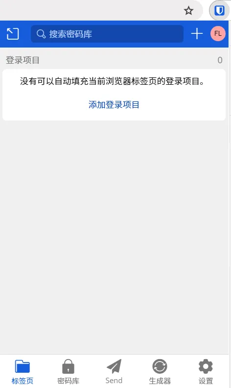
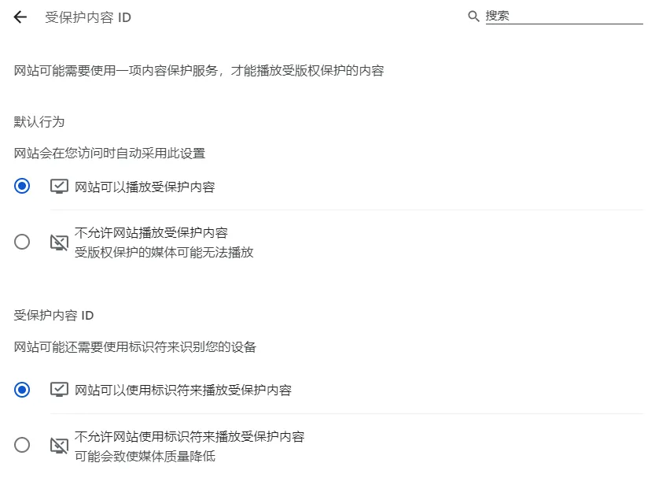
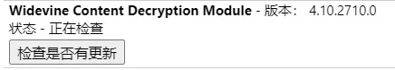

# ungoogled chromium 安装配置


## 介绍

ungoogled-chromium 是基于 Chromium 的衍生版本，代码同样开源。相比起 Chromium，其剥离了所有来自 Google 的网络服务组件，进一步屏蔽 Google 内置于浏览器中的各种数据收集行为（比如： Google Safe Browsing API 会收集你浏览的所有网站地址用于恶意网址识别）。

- 彻底移除了 Google 服务相关组件，ungoogled-chromium 无法在线安装 Chrome 扩展插件，后文将提供解决方法。

- ungoogled-chromium 移除了自动更新功能，你可以根据自己的使用习惯，择期对软件进行更新。

官网：<https://ungoogled-software.github.io/>
Github：<https://github.com/ungoogled-software/ungoogled-chromium>



## 安装方法

### Windows

只支持 x86、x86_64 架构。

下载链接：<https://github.com/ungoogled-software/ungoogled-chromium-windows/releases>

### Linux

#### OpenSUSE Tumbleweed

```sh
zypper in ungoogled-chromium
```

#### Arch Linux

仓库地址：<https://github.com/ungoogled-software/ungoogled-chromium-archlinux>

#### Fedora

```sh
# fedora 35
dnf config-manager --add-repo https://download.opensuse.org/repositories/home:/ungoogled_chromium/Fedora_35/home:ungoogled_chromium.repo
dnf install ungoogled-chromium
```

```sh
# fedora 34
dnf config-manager --add-repo https://download.opensuse.org/repositories/home:/ungoogled_chromium/Fedora_34/home:ungoogled_chromium.repo
dnf install ungoogled-chromium
```

手动下载安装：<https://build.opensuse.org/project/show/home:ungoogled_chromium>

#### 其他 Linux

##### Flatpak

`com.github.Eloston.UngoogledChromium`

##### GNU Guix

`ungoogled-chromium`

##### NixOS/nixpkgs

`ungoogled-chromium`

### MacOS

通过 brew 安装：

```sh
brew install --cask eloston-chromium
```

手动安装：<https://github.com/ungoogled-software/ungoogled-chromium-macos/releases>

### 其他系统

上述未列出的系统，可以通过下方链接下载：

<https://ungoogled-software.github.io/ungoogled-chromium-binaries/>

## 配置

### 修复在线扩展问题

1. 浏览器打开地址 `chrome://flags/#extension-mime-request-handling`，修改为[Always prompt for install]；
2. 下载扩展 <https://github.com/NeverDecaf/chromium-web-store/releases>，将下载好的 `.crx` 文件拖到 `chrome://extensions/` 页面安装；
3. chromium-web-store 可以自动检测插件版本，但无法自动更新插件，需要手动点击需要更新的插件进行安装。


如果 Chrome 的在线商城无法安装扩展，可借用 Edge 的来安装：<https://microsoftedge.microsoft.com/addons>

### 保留历史记录和 Cookie

ungoogled-chromium 在默认情况下，关闭浏览器时会清除所有网站的 Cookie。此举虽然能保护隐私，但是每次打开浏览器的时候都要重新登陆各种网站和服务，在实际使用中颇为不便。

在 `chrome://settings/cookies` 设置中将「常规设置」的选项修改为「在无痕模式下阻止第三方 Cookie」。



设置 `chrome://flags/#keep-old-history` 为 [Enable] 以保留历史记录。



### 添加 Google 搜索

由于所有的 Google 服务被关闭，Google 搜索需要手动添加

1. 打开 `chrome://settings/searchEngines`；
2. 点击添加网站搜索，按照下方内容填写
3. 搜索引擎：Google
4. 快捷字词：google.com
5. 网址格式：`https://www.google.com/search?q=%s&{google:RLZ}{google:originalQueryForSuggestion}{google:assistedQueryStats}{google:searchFieldtrialParameter}{google:iOSSearchLanguage}{google:prefetchSource}{google:searchClient}{google:sourceId}{google:contextualSearchVersion}ie={inputEncoding}`
6. 推荐地址：`https://www.google.com/complete/search?client=chrome&q=%s`
7. 保存后设置为默认搜索引擎即可



### Flags 设置

打开 `chrome://flags/` 搜索对应的选项。

> 已在 Windows 11 22H2 x86_64，ungoogled-chromium v122.0.6261.69 下测试正常。

#### 推荐选项

| 选项                           | 说明                                                                    |
| ------------------------------ | ----------------------------------------------------------------------- |
| #show-avatar-button            | [Disabled] 隐藏用户按钮                                                 |
| #remove-tabsearch-button       | [Enabled] 可以隐藏搜索标签页按钮                                        |
| #disable-qr-generator          | [Enabled] 可以隐藏地址栏中的二维码图标                                  |
| #disable-sharing-hub           | [Enabled] 可以隐藏地址栏中的分享图标                                    |
| #hide-sidepanel-button         | [Enabled] 可以隐藏浏览器侧边栏/阅读列表                                 |
| #chrome-labs                   | [Enabled] 去除实验室图标                                                |
| #enable-tab-audio-muting       | [Enabled] 标签页静音功能                                                |
| #scroll-tabs                   | [Enabled] 滚轮切换标签                                                  |
| #custom-ntp                    | [Enabled] 修改新标签地址（修改为 `chrome://new-tab-page` 即可修改主题） |
| #smooth-scrolling              | [Enabled] 平滑滚动                                                      |
| #windows-scrolling-personality | [Enabled] 修复 Windows 下滚动不流畅问题                                 |
| #remove-tabsearch-button       | [Enabled] 去除标签搜索按钮                                              |
| #enable-parallel-downloading   | [Enabled] 启用多线程下载                                                |
| #chrome-refresh-2023           | [Enabled] 新的 Chrome UI (需要同时开启)                                 |
| #chrome-webui-refresh-2023     | [Enabled] 新的 Chrome UI (需要同时开启)                                 |
| #customize-chrome-side-panel   | [Enabled] 新的 Chrome UI (需要同时开启)                                 |
| #fluent-scrollbars             | [Enabled] win11 风格的滚动条(需要系统支持)                              |
| #windows11-mica-titlebar       | [Enabled] Win11 Mica 风格透明标题栏(需要系统支持)                       |

#### 其他选项

**警告：下列选项请根据需要酌情使用！**

| 选项                                  | 说明                                                                    |
| ------------------------------------- | ----------------------------------------------------------------------- |
| #temporary-unexpire                   | [Enabled] 使所有暂时失效的选项重新可用                                  |
| #set-ipv6-probe-false                 | [Disabled] ipv6 探测                                                    |
| #enable-quic                          | [Enabled] HTTP3 QUIC 协议支持                                           |
| #ignore-gpu-blocklist                 | [Enabled] 强制开启 GPU 加速                                             |
| #enable-gpu-rasterization             | [Enabled] GPU 光栅化处理页面                                            |
| #zero-copy-video-capture              | [Enabled] 零拷贝视频捕获                                                |
| #enable-zero-copy                     | [Enabled] 零拷贝光栅化                                                  |
| #enable-drdc                          | [Enabled] GPU 合成器使用单独的线程                                      |
| #use-angle                            | [D3D11] ANGLE 图形后端(N 卡推荐 OpenGL，其他独显 D3D11on12，核显 D3D11) |
| #canvas-oop-rasterization             | [Enabled] 在 GPU 进程中执行 Canvas 2D 光栅化                            |
| #enable-oop-print-drivers             | [Enabled] 使与操作系统的打印交互可以在进程外进行                        |
| #enable-raw-draw                      | [Enabled] 启用 Raw Draw                                                 |
| #background-resource-fetch            | [Enabled] 使用 Blink 后台引擎获取资源                                   |
| #ui-enable-shared-image-cache-for-gpu | [Enabled] 共享 GPU 图像解码缓存                                         |
| #enable-zstd-content-encoding         | [Enabled] zstd 压缩格式                                                 |
| #enable-shared-zstd                   | [Enabled] zstd 压缩格式                                                 |
| #use-gpu-scheduler-dfs                | [Enabled] 新的 GPU 调度器                                               |
| #use-client-gmb-interface             | [Enabled] 使用新的 ClientGmb 接口创建 GPU 缓存                          |

### 收藏夹和密码同步

由于 Google 全家桶无法使用，也就无法登录谷歌账号，这里我使用的是第三方收藏夹和密码同步插件。

WebDAV 和 BitWarden 均为服务器自建。

- 收藏夹：<https://floccus.org/>



- 密码：<https://bitwarden.com/>



### DRM 数字版权保护功能

使用 ungoogled-chromium 访问流媒体网站，可能会发现一些版权内容无法播放，特别是观看一些从国外进口的影视版权资源时，非常容易遇到这个问题。

播放该资源需要浏览器支持 DRM 数字版权保护技术，而 Chrome 数字版权保护所需的 Widevine 组件并没有随 Chromium 项目一同开源。Widevine 是 Google 于 2010 年收购的一种数字版权保护技术，作为组件内置于 Chrome 中。其本身用于加密/解密版权内容，未包含在 Chromium 开源项目内也情有可原。

可以打开页面 `chrome://settings/content/protectedContent` 检查 Widevine 组件是否有效。



解决思路也很简单，找到最新版 Widevine 组件、或者最新版本的 Chrome 安装包，把 Widevine 相关文件提取出来，「搬」到指定的文件路径中，重启浏览器即可恢复浏览器 DRM 数字版权保护功能。

1. 下载版本文件：<https://dl.google.com/widevine-cdm/versions.txt>
2. 根据上面的版本文件，根据系统下载最新版本的组件：
   - https://dl.google.com/widevine-cdm/<版本号>-win-x64.zip
   - https://dl.google.com/widevine-cdm/<版本号>-win-ia32.zip
   - https://dl.google.com/widevine-cdm/<版本号>-mac-x64.zip
   - https://dl.google.com/widevine-cdm/<版本号>-linux-x64.zip
3. 进入 `浏览器安装目录/<浏览器版本号>` 文件夹下（可以通过 `chrome://version/` 查看）
4. 按照下列结构放置插件

```text
WidevineCdm （如果不存在则新建）
  ├── LICENSE.txt
  ├── manifest.json
  │
  ├── _platform_specific
         ├── win_x64 （这个文件夹名需要根据你实际下载的决定）
              ├── widevinecdm.dll
              ├── widevinecdm.dll.lib
              ├── widevinecdm.dll.sig
```

5. 重启浏览器，打开 `chrome://components/` 可以找到对应的插件版本



> 插件安装参考：<https://chromium.woolyss.com/#widevine>
