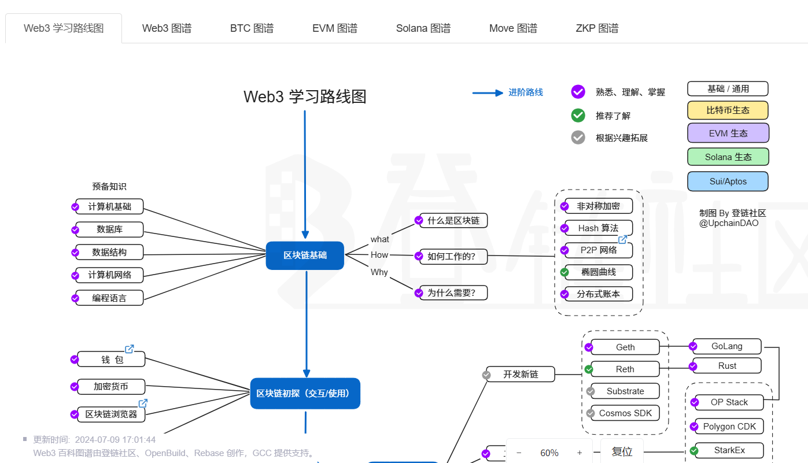

# Web 笔记



## Web 3 学习路线图

<https://learnblockchain.cn/maps/Roadmap>


## 检测浏览器的巧妙方法

通常，我们检测浏览器是通过获取 `navigator.userAgent`，但 ua 是可以通过浏览器设置或浏览器插件人为更改的，这种方法就不够准确。

这里推荐两个巧妙的方法：

### ComputedStyle 检测 CSS 前缀

> 参考：<https://davidwalsh.name/vendor-prefix>

```javascript
  /**
 * 获取所有 ComputedStyle 检测 CSS 前缀
 */
function detectBrowserByComputedStyle() {
  const computedStyle = window.getComputedStyle(document.documentElement, '')
  const prefix = Array.prototype.slice.call(computedStyle).join('').match(/-(moz|webkit|ms)-/)[1]
  return {
    webkit: prefix === 'webkit',
    moz: prefix === 'moz',
    ms: prefix === 'ms',
    o: prefix === 'o',
  }
}
```

### 检测 js 的相关功能

> 参考：<https://stackoverflow.com/questions/9847580/how-to-detect-safari-chrome-ie-firefox-and-opera-browsers/9851769>

```javascript
  /**
 * 通过 feature 检测浏览器
 */
function detectBrowserByFeature() {
  // Opera 8.0+
  const isOpera = (!!window.opr && !!opr.addons) || !!window.opera || navigator.userAgent.indexOf(' OPR/') >= 0
  // Firefox 1.0+
  const isFirefox = typeof InstallTrigger !== 'undefined'
  // Safari 3.0+
  const isSafari = /constructor/i.test(window.HTMLElement)
    || ((typeof safari !== 'undefined' && window['safari'].pushNotification)).toString() ===
    '[object SafariRemoteNotification]'
  // Internet Explorer 6-11
  const isIE = !!window.ActiveXObject || 'ActiveXObject' in window || !!document.documentMode
  // 旧 Edge 20+
  const isEdge = !isIE && !!window.StyleMedia
  // Chrome 1 - 79
  const isChrome = !!window.chrome
  // 新 Edge
  const isEdgeChromium = isChrome && (navigator.userAgent.indexOf('Edg') != -1)
  // Blink 渲染引擎
  const isBlink = (isChrome || isOpera) && !!window.CSS

  return {
    isOpera, isFirefox, isSafari, isIE, isEdge, isChrome, isEdgeChromium, isBlink,
  }
}
```

## HTML 防蜘蛛

> 都是防君子不防小人的方法

使用 HTML 标签，告诉搜索引擎不需要索引

```html
<meta name="robots" content="noindex, nofollow" />
```

使用 robots.txt

```text
User-agent: *
Disallow: *
```
