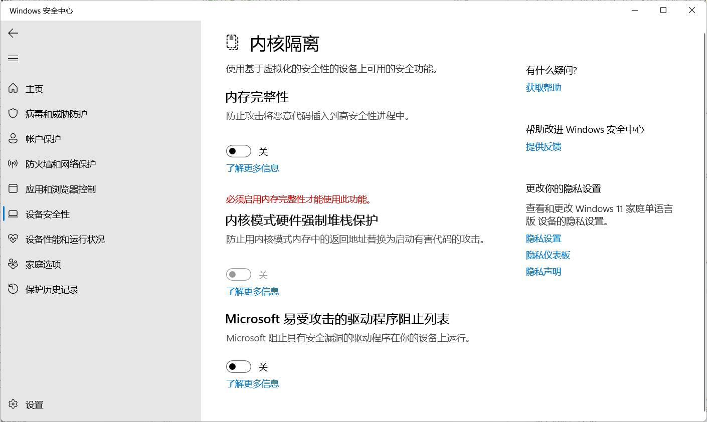

# Windows 使用笔记


## 优化 Windows Defender 性能

### 设置扫描占用的 CPU 比例

查看当前的CPU占用比例，默认一般是 50

```powershell
Get-MpPreference | select ScanAvgCPULoadFactor
```

调整CPU占用比例，例如设置为 20

```powershell
Set-MpPreference -ScanAvgCPULoadFactor 20
```

### 关闭映射磁盘文件扫描

```powershell
Set-MpPreference -DisableScanningNetworkFiles 1
Set-MpPreference -DisableScanningMappedNetworkDrivesForFullScan 1
```

## 彻底关闭 Hyper-V、WSL、Device Guard、Credential Guard

> 关闭下列基于虚拟化的相关服务和模块以提升性能
>
> **注意：** WSL2、Docker Desktop、Podman Desktop 等基于 Hyper-V 的软件将无法工作
>
> ~~反正我不用这些软件~~

### 关闭 Hyper-V 以及相关服务

首先在终端管理员中关闭 Hyper-V

```powershell
Disable-WindowsOptionalFeature -Online -FeatureName Microsoft-Hyper-V-Hypervisor
bcdedit /set hypervisorlaunchtype off
```

再进入 Windows 功能关闭其他功能


### 关闭内存完整性



### 关闭 Device Guard

进入注册表

```text
HKEY_LOCAL_MACHINE\SYSTEM\CurrentControlSet\Control\DeviceGuard

EnableVirtualizationBasedSecurity = 0
RequirePlatformSecurityFeatures = 0
```

### 关闭 Credential Guard

进入注册表

```text
HKEY_LOCAL_MACHINE\SYSTEM\CurrentControlSet\Control\Lsa

LsaCfgFlags = 0
```

```text
HKEY_LOCAL_MACHINE\SOFTWARE\Policies\Microsoft\Windows\DeviceGuard

LsaCfgFlags = 0
```

进入管理员 CMD

```cmd
mountvol X: /s
copy %WINDIR%\System32\SecConfig.efi X:\EFI\Microsoft\Boot\SecConfig.efi /Y
bcdedit /create {0cb3b571-2f2e-4343-a879-d86a476d7215} /d "DebugTool" /application osloader
bcdedit /set {0cb3b571-2f2e-4343-a879-d86a476d7215} path "\EFI\Microsoft\Boot\SecConfig.efi"
bcdedit /set {bootmgr} bootsequence {0cb3b571-2f2e-4343-a879-d86a476d7215}
bcdedit /set {0cb3b571-2f2e-4343-a879-d86a476d7215} loadoptions DISABLE-LSA-ISO
bcdedit /set {0cb3b571-2f2e-4343-a879-d86a476d7215} device partition=X:
mountvol X: /d
```

### 禁用基于虚拟化的安全性

删除下列注册表项

```text
HKEY_LOCAL_MACHINE\SYSTEM\CurrentControlSet\Control\DeviceGuard

- EnableVirtualizationBasedSecurity
- RequirePlatformSecurityFeatures
```

进入管理员 CMD

```text
bcdedit /set {0cb3b571-2f2e-4343-a879-d86a476d7215} loadoptions DISABLE-LSA-ISO,DISABLE-VBS
bcdedit /set vsmlaunchtype off
```

**重启电脑后会提示关闭 Credential Guard，按 `Win + F3` 确认**

## 安装开启 Hyper-V

```cmd
pushd "%~dp0"
dir /b %SystemRoot%\servicing\Packages\*Hyper-V*.mum >hyper-v.txt
for /f %%i in ('findstr /i . hyper-v.txt 2^>nul') do dism /online /norestart /add-package:"%SystemRoot%\servicing\Packages\%%i"
del hyper-v.txt
Dism /online /enable-feature /featurename:Microsoft-Hyper-V-All /LimitAccess /ALL
```

## 重新编译 .net framework 机器码

```powershell
$env:PATH = [Runtime.InteropServices.RuntimeEnvironment]::GetRuntimeDirectory()
[AppDomain]::CurrentDomain.GetAssemblies() | ForEach-Object {
    $path = $_.Location
    if ($path) {
        $name = Split-Path $path -Leaf
        Write-Host -ForegroundColor Yellow "`r`n$name"
        ngen.exe install $path /nologo
    }
}
```

## 清除图标缓存

```cmd
taskkill /f /im explorer.exe

cd /d %userprofile%\AppData\Local\Microsoft\Windows\Explorer

attrib -h iconcache_*.db

del iconcache_*.db /a

CD /d %userprofile%\AppData\Local

DEL IconCache.db /a

start explorer

start explorer.exe

cho 执行完成
```

## 安装开启组策略

```cmd
@echo off
pushd "%~dp0"
dir /b C:\Windows\servicing\Packages\Microsoft-Windows-GroupPolicy-ClientExtensions-Package~3*.mum >List.txt
dir /b C:\Windows\servicing\Packages\Microsoft-Windows-GroupPolicy-ClientTools-Package~3*.mum >>List.txt
for /f %%i in ('findstr /i . List.txt 2^>nul') do dism /online /norestart /add-package:"C:\Windows\servicing\Packages\%%i"
pause
```

## powershell 配置

```powershell
$Env:POWERSHELL_UPDATECHECK="LTS"

$OutputEncoding = [console]::InputEncoding = [console]::OutputEncoding = New-Object System.Text.UTF8Encoding

Import-Module PSReadLine
Set-PSReadLineOption -Colors @{
    Command                = [ConsoleColor]::Blue
    Comment                = [ConsoleColor]::DarkGray
    ContinuationPrompt     = [ConsoleColor]::White
    Default                = [ConsoleColor]::White
    Emphasis               = [ConsoleColor]::Cyan
    Error                  = [ConsoleColor]::Red
    InlinePrediction       = [ConsoleColor]::DarkGray
    Keyword                = [ConsoleColor]::DarkBlue
    ListPrediction         = [ConsoleColor]::DarkGray
    ListPredictionSelected = "$([char]0x1b)[30;47m"
    Member                 = [ConsoleColor]::Magenta
    Number                 = [ConsoleColor]::Blue
    Operator               = [ConsoleColor]::White
    Parameter              = [ConsoleColor]::White
    String                 = [ConsoleColor]::DarkGreen
    'Type'                 = [ConsoleColor]::Green
    Variable               = [ConsoleColor]::Yellow
}
Set-PSReadLineOption -PredictionSource History
Set-PSReadLineOption -HistorySearchCursorMovesToEnd
Set-PSReadLineKeyHandler -Key "Tab" -Function MenuComplete
Set-PSReadlineKeyHandler -Key "Ctrl+d" -Function ViExit
Set-PSReadLineKeyHandler -Key "Ctrl+z" -Function Undo
Set-PSReadLineKeyHandler -Key UpArrow -Function HistorySearchBackward
Set-PSReadLineKeyHandler -Key DownArrow -Function HistorySearchForward

function ListDirectory {
    (Get-ChildItem).Name
    Write-Host("")
}
Set-Alias -Name ls -Value ListDirectory -Option AllScope
Set-Alias -Name ll -Value Get-ChildItem -Option AllScope

function OpenCurrentFolder {
    param
    (
        $Path = '.'
    )
    Invoke-Item $Path
}
Set-Alias -Name open -Value OpenCurrentFolder -Option AllScope

Set-Alias -Name pn -Value pnpm -Option AllScope

Invoke-Expression (&starship init powershell)

```
