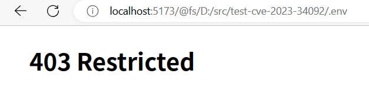
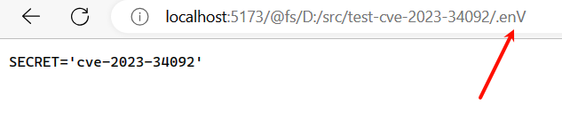
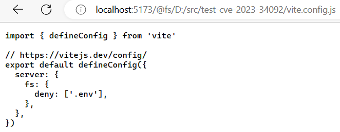

# CVE-2023-34092

前几天突然收到 Github 发好几个邮件，基本都是提醒 Vite 有漏洞提醒更新版本，打算来复现一下这个 `CVE-2023-34092`。

复现用的代码已上传至 Github：<https://github.com/FlapyPan/test-cve-2023-34092>

## 说明

在不区分大小写的文件系统上（Windows），可绕过 `vite.config.js` 中 `server.fs.deny` 配置的被禁止访问的文件。

## 影响范围

> = 5.0.0，<= 5.0.11

## 补丁

已在 5.0.12、4.5.2、3.2.8、2.9.17 中修复。

## 复现过程

### 环境配置

1. 使用 `npm create vite` 创建标准的 vite 项目。
2. 指定 vite 版本 `npm install vite@5.0.11`。
3. 创建 `.env` 文件，添加内容。
4. 在 `vite.config.js` 中配置 `server: { fs: { deny: ['.env'] } }`。
5. `npm run dev` 启动。

### 验证

1. 使用浏览器或 curl 命令访问 `http://localhost:5173/@fs/<项目路径>/.env`，无法访问。

2. 将其中的部分字符改为大写 `http://localhost:5173/@fs/<项目路径>/.enV`，成功获取。

3. 甚至可直接查看 `http://localhost:5173/@fs/<项目路径>/vite.config.js` 来获取被禁用的文件列表。

> 完整说明参考：<https://nvd.nist.gov/vuln/detail/CVE-2023-34092>
