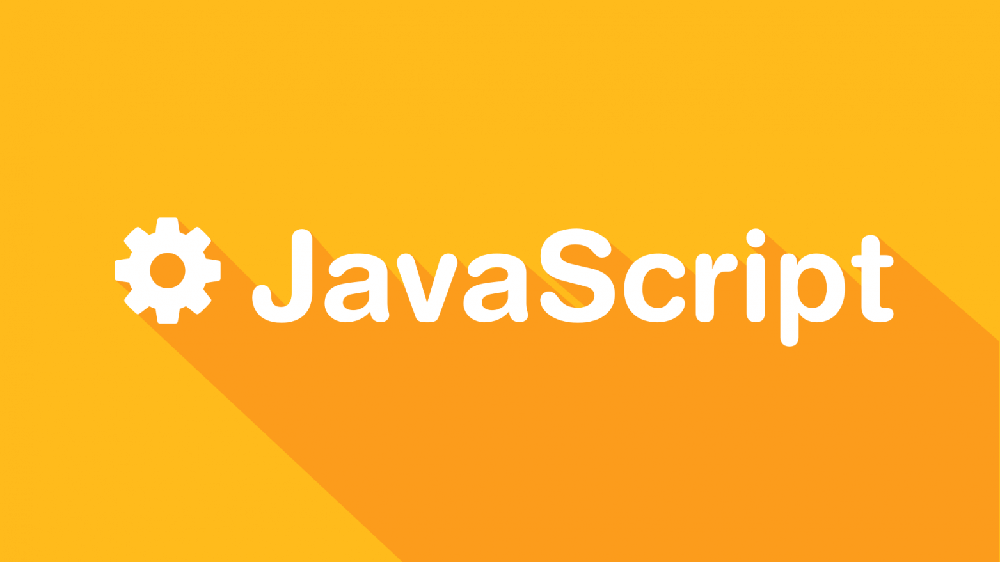

# JS 常见基础面试题



## 前言

花了点时间收录了一些 JavaScript 相关的概念，大部分内容只是一笔带过，详细了解相关概念请自行使用 MDN、StackOverflow、Google
查询（八股也只是作为一个目录，学习得靠自己）。

**注意：** 目前仅收录 JavaScript 语法及相关 API 的内容，HTML、CSS 等相关内容后续单独开设文章。

## 基础语法和关键字

### let 和 const，var 的区别

let、const 和 var 是用于声明变量的关键字，区别如下：

**作用域：**

var：使用 var 声明的变量具有函数作用域或全局作用域。如果在函数内部声明的变量，那么它只在该函数内部有效。如果在函数外部声明的变量，那么它在整个代码文件中都有效。

```js
for (var i = 0; i < 10; i++) {
// ...
}
console.log(i) // i 为 10
```

let 和 const：使用 let 和 const 声明的变量具有块级作用域。块级作用域是指变量只在声明的代码块（通常是花括号 {}
包裹的区域）内有效。在函数内部或其他块级作用域内使用 let 或 const 声明的变量，在代码块外部是无法访问的。

```js
// for 就是一个块级作用域
for (let i = 0; i < 10; i++) {
// ...
}
console.log(i) // 报错 i 不存在
```

**变量提升：**

var：使用 var 声明的变量会发生变量提升。这意味着变量声明会被提升到代码的顶部，但变量的赋值仍然保留在原来的位置。因此，在变量声明之前访问变量，会返回
undefined。

```js
console.log(a) // undefined
var a = 1
console.log(a) // 1
```

let 和 const：使用 let 和 const 声明的变量也会进行变量提升，但与 var 不同，let 和 const
的变量在变量声明之前是不可访问的。这种现象称为"暂时性死区"（Temporal Dead Zone，TDZ）。

```js
console.log(a) // 报错
let a = 1
console.log(a)
```

**重复声明：**

var：使用 var 可以重复声明同一个变量，而不会报错。在重复声明后，变量会被覆盖。

```js
var a = 1
console.log(a) // 1
var a = 2
console.log(a) // 2
```

let 和 const：使用 let 和 const 声明的变量在同一作用域内不允许重复声明，否则会导致语法错误。

```js
let a = 1
console.log(a) // 1
let a = 2 // 报错，a 已经定义过
console.log(a)
```

**变量值的修改：**

var 和 let：使用这两个关键字声明的变量，其值可以修改。

const：使用 const 声明的变量是常量，其值在声明后不能再修改。

```js
var a = 1
a = 2
let b = 1
b = 2
const c = 1
c = 2 // 报错
```

### js 中的基础类型和对象类型

在 JavaScript 中，基础类型（Primitive Types）和对象类型（Object Types）是两种不同的数据类型。

基础类型包括以下几种：

```js
// 数字 Number
let num1 = 123_456_789
let num2 = NaN
let num3 = Infinity
console.log(typeof num1, typeof num2, typeof num3) // number number number

// 字符串字面量 string
let str = 'hello,world'
console.log(typeof str) // string
// PS：使用构造函数创建的是字符串对象
console.log(typeof new String('hello')) // object

// 布尔值 Boolean
let b = false
console.log(typeof b) // boolean

// 空类型 Null
let n = null
console.log(typeof n) // object

// 未定义 undefined
let undef1 = undefined
let undef2 = void 0
let undef3
console.log(typeof undef1, typeof undef2, typeof undef3) // undefined undefined undefined

// 大整数 BigInt
let theBiggestInt = 9007199254740991n
let alsoHuge = BigInt(9007199254740991)
let hugeString = BigInt('9007199254740991')
let hugeHex = BigInt('0x1fffffffffffff')
let hugeBin = BigInt('0b11111111111111111111111111111111111111111111111111111')
console.log(typeof theBiggestInt) // bigint

// 符号 Symbol
let s = Symbol()
console.log(typeof s) // symbol
```

对象类型包括以下几种：

```js
// 对象 Object
let obj1 = {}
let obj2 = { hello: 'hello' }
console.log(typeof obj1, typeof obj2) // object object

// 数组 Array
let arr1 = []
let arr2 = Array()
console.log(typeof arr1, typeof arr2) // object object
// PS：判断数组应该使用 Array.isArray 方法
console.log(Array.isArray(arr1)) // true

// 函数 Function
function f1() {}
const f2 = () => {}
console.log(typeof f1, typeof f2) // function function

```

主要区别如下：

- 存储方式：基础类型存储在栈内存中，而对象类型存储在堆内存中。栈内存的访问速度较快，而堆内存的访问速度较慢。
- 拷贝方式：基础类型的值在赋值时会直接拷贝，而对象类型在赋值时实际上只是复制了一个指向对象的引用，指向同一个对象。
- 比较方式：基础类型的比较是按值比较，对象类型的比较是按引用比较，即比较两个对象是否指向同一个内存地址。

### typeof 与 instanceof

typeof 是一个一元运算符，用于返回一个表示操作数类型的字符串。它可以用于判断一个值的类型。

instanceof 是一个二元运算符，用于检测构造函数的原型对象是否存在于目标对象的原型链上。它用于判断一个对象是否是某个构造函数的实例，返回一个布尔值。

相同点：

- 都是用于判断值或对象的类型。

不同点：

- typeof 返回一个表示操作数类型的字符串，而 instanceof 返回一个布尔值。
- typeof 可以判断基本数据类型和函数类型，而 instanceof 用于判断对象的实例关系。
- typeof 对于数组、null 等特殊类型的判断不准确，而 instanceof 可以精确判断对象的实例关系。

例子：

```js
console.log(typeof 'hello') // string
console.log(typeof new String('')) // object

console.log('' instanceof String) // false
console.log(new String('') instanceof String) // true

class A {}

class B {}

let a = new A()
let b = new B()
console.log(typeof a, typeof b) // object object
console.log(a instanceof A) // true
console.log(a instanceof B) // false
console.log(a instanceof Object) // true
```

### 模板字符串

正确的名称是**模板字面量**

模板字面量是用反引号（`）分隔的字面量，允许多行字符串、带嵌入表达式的字符串插值和一种叫带标签的模板的特殊结构。

基础语法：

```js
`string text`

  `string text line 1
 string text line 2`

  `string text ${expression} string text`
```

嵌套使用：

```js
const str = `header ${
  isLargeScreen() ? "" : `icon-${item.isCollapsed ? "expander" : "collapser"}`
}`
```

带标签的模板：

```js
const person = "Mike";
const age = 28;

function myTag(strings, personExp, ageExp) {
  const str0 = strings[0]; // "That "
  const str1 = strings[1]; // " is a "
  const str2 = strings[2]; // "."

  const ageStr = ageExp > 99 ? "centenarian" : "youngster";

  // 我们甚至可以返回使用模板字面量构建的字符串
  return `${str0}${personExp}${str1}${ageStr}${str2}`;
}

const output = myTag`That ${person} is a ${age}.`;

console.log(output);
// That Mike is a youngster.
```

### 箭头函数

箭头函数是 ES6 中引入的一种新的函数表达式，是一种更简洁的语法来定义函数。

```js
const getOne = () => 1
const printOne = () => {
  console.log(1)
}

console.log(getOne()) // 1
printOne() // 1
```

箭头函数相较于传统的函数表达式，具有以下特点：

- 简洁：省略了 function 关键字和大括号，使得函数的定义更加简洁。

- 隐式返回：如果函数体只有一条语句，且不需要返回值，可以省略大括号和 return 关键字，函数会自动将该语句的结果作为返回值。

- 词法作用域：箭头函数不会创建自己的 this，它的 this 绑定在定义时的作用域，而不是调用时的作用域。这意味着在箭头函数内部，无法通过
  this 来访问函数的调用者。

### 闭包

闭包是一个函数和其周围状态的组合，其中函数可以访问在创建它时存在的非局部变量。换句话说，闭包可以访问在创建它时的父函数的变量和参数，即使父函数已经返回并且执行上下文已经销毁。

```js
function outer() {
  var outerVariable = '外部作用域'

  function inner() {
    var innerVariable = '内部作用域'
    console.log(innerVariable)
    console.log(outerVariable)
  }

  return inner
}

var closure = outer()
closure()
```

闭包的主要用途：

- 封装变量：通过闭包，可以创建私有变量，避免全局命名空间的污染。闭包内部的变量对外部是不可访问的，因此可以实现封装和信息隐藏的效果。
- 保持状态：闭包可以在函数调用之间保持状态，即使函数执行结束后，闭包仍然可以保持对状态的引用。这对于一些需要记住状态的场景非常有用，例如计数器、缓存等。
- 实现函数式编程的技术：闭包可以使函数具有记忆能力，可以返回一个新的函数，该函数可以记住之前的参数和操作，从而实现柯里化（Currying）和函数组合等函数式编程的技术。

### Symbol 类型

Symbol 是 JavaScript 中的一种原始数据类型。它是在 ECMAScript 6 (ES6) 标准中引入的，用于表示独一无二的标识符。每个通过
Symbol() 构造函数创建的 Symbol 值都是唯一的，不会与其他任何值相等。

Symbol 类型的特点如下：

独一无二性：每个 Symbol 值都是唯一的，无法通过简单的值比较相等。
不可变性：Symbol 值一旦创建，就不能被修改。
作为属性键：Symbol 可以作为对象的属性键，用于创建对象的私有属性或隐藏属性，以避免命名冲突。
隐藏性：使用 Symbol 作为属性键，这些属性对于常规的对象遍历和操作是不可见的。

1. 创建唯一的属性键

```js
const id: symbol = Symbol('id')
console.log(id) // 输出: Symbol(id)

const obj = {
  [id]: 123,
}
console.log(obj[id]) // 输出: 123
```

2. 防止属性名冲突

```js
const firstName = Symbol('firstName')
const person = {
  [firstName]: 'John',
  lastName: 'Doe',
}
console.log(person[firstName]) // 输出: "John"
```

3. 常见的 Symbol 方法
    - Symbol.iterator：表示对象是可迭代的，可以使用 for...of 循环进行迭代。
    - Symbol.asyncIterator：表示对象是可异步迭代的，可以使用 for await...of 循环进行异步迭代。
    - Symbol.match：表示对象的正则匹配方法。
    - Symbol.replace：表示对象的正则替换方法。
    - Symbol.search：表示对象的正则搜索方法。
    - Symbol.species：表示对象的构造函数。
    - Symbol.hasInstance：表示对象是一个构造函数的实例。
    - Symbol.toPrimitive：表示对象的默认转换方法。

### for 循环和 forEach 循环的区别

for 循环是一种基本的循环结构，通过控制循环变量的起始值、结束条件和每次迭代的步长来遍历数组或其他可迭代对象。它可以使用传统的
for、while 或 do-while 语句实现。

forEach 循环是数组的原生方法之一，它提供了一种简洁的方式来遍历数组的每个元素，并执行指定的回调函数。forEach
方法接收一个回调函数作为参数，该回调函数会在数组的每个元素上执行一次。

区别：

- 语法：for 循环的语法比较复杂，需要手动控制循环变量和循环条件。而 forEach 循环是数组的原生方法，直接在数组对象上调用，语法更简洁。
- 循环控制：for 循环可以在循环体内使用 break 和 continue 语句来控制循环的终止和跳过。而 forEach
  循环无法中途跳出或终止循环，它会一直遍历数组的每个元素。

例子：

```js
const arr = [1, 2, 3, 4, 5]

for (let i = 0; i < arr.length; i++) {
  console.log(arr[i])
}

arr.forEach((value, i, array) => {
  // 值、索引、原数组
  console.log(value, i, array)
})
```

### JavaScript 中的作用域链（Scope Chain）

作用域链是指在 JavaScript 中变量和函数的查找机制。当访问一个变量或调用一个函数时，JavaScript 引擎会按照作用域链的顺序来查找对应的标识符。

作用域链由当前作用域和它的上层作用域组成，一直延伸到全局作用域。当一个函数嵌套在另一个函数内部时，内部函数可以访问外部函数的变量和函数，这是因为内部函数的作用域链包含了外部函数的作用域。

```js
function outer() {
  var outerVariable = 'I am outer'

  function inner() {
    var innerVariable = 'I am inner'
    console.log(innerVariable) // 访问内部函数的变量
    console.log(outerVariable) // 访问外部函数的变量
    console.log(globalVariable) // 访问全局变量
  }

  inner()
}

var globalVariable = 'I am global'
outer()
```

## 常用方法和 API

### 数组的常用方法

- push：向数组末尾添加一个或多个元素，并返回数组的新长度。
- pop：删除并返回数组的最后一个元素。
- shift：删除并返回数组的第一个元素。
- unshift：向数组的开头添加一个或多个元素，并返回数组的新长度。
- concat：将多个数组合并成一个新数组，不影响原数组。
- slice：返回一个从指定位置开始到结束位置之间的新数组。
- splice：从指定位置开始删除指定数量的元素，并可选地插入新元素。
- forEach：遍历数组的每个元素，并执行回调函数。
- map：遍历数组的每个元素，并返回一个新数组，新数组的元素由回调函数的返回值组成。
- filter：遍历数组的每个元素，根据回调函数的返回值筛选出符合条件的元素，并返回一个新数组。
- reduce：将数组的每个元素累积到一个单独的值中。
- find：返回数组中满足条件的第一个元素。
- some：判断数组中是否至少存在一个元素满足条件。
- every：判断数组中的所有元素是否都满足条件。

示例：

```js
const arr = [1, 2, 3]

const lenAfterPush = arr.push(4, 5, 6)
console.log(lenAfterPush) // 6
console.log(arr) // [1, 2, 3, 4, 5, 6]

const popNum = arr.pop()
console.log(popNum) // 6
console.log(arr) // [1, 2, 3, 4, 5]

const shiftNum = arr.shift()
console.log(shiftNum) // 1
console.log(arr) // [2, 3, 4, 5]

const lenAfterUnshift = arr.unshift(0, 1)
console.log(lenAfterUnshift) // 6
console.log(arr) // [0, 1, 2, 3, 4, 5]

const concatArr = arr.concat([6], [7, 8])
console.log(concatArr) // [0, 1, 2, 3, 4, 5, 6, 7, 8]

const sliceArr = arr.slice(2, 4)
console.log(sliceArr) // [2, 3]

arr.splice(0, 2)
console.log(arr) // [2, 3, 4, 5]

arr.forEach((value, index, array) => {
  console.log(`值：${value}，索引：${index}，原数组：${array}`)
})

const mapArr = arr.map((n) => n * 2)
console.log(mapArr) // [4, 6, 8, 10]

const filterArr = arr.filter((n) => n % 2 === 0)
console.log(filterArr) // [2, 4]

const some = arr.some((n) => n === 3)
console.log(some) // true

const every = arr.every((n) => n > 0)
console.log(every) // true

```

### bind、call、apply 区别

bind、call 和 apply 是 JavaScript 中用于改变函数执行上下文的方法。

- bind：bind 方法会创建一个新函数，并将新函数的执行上下文绑定到指定的对象。该方法返回一个绑定后的函数，但并不立即执行。
- call：call 方法会立即执行函数，并将函数的执行上下文绑定到指定的对象。除了第一个参数是绑定的对象外，后续的参数是函数调用时的参数。
- apply：apply 方法与 call 类似，但接受的参数是以数组或类数组形式传递的。

示例：

```js
function logThis(arg) {
  console.log(this, arg)
}

logThis('直接调用') // globalThis '直接调用'

const obj = { name: 'obj' }
logThis.bind(obj)('bind 调用') // { name: 'obj' } 'bind 调用'
logThis.call(obj, 'call 调用') // { name: 'obj' } 'call 调用'
logThis.apply(obj, ['apply 调用']) // { name: 'obj' } 'apply 调用'

```

### Promise.all、Promise.race、Promise.allSettled

**Promise.all** 接收一个 Promise 数组作为参数，返回一个新的 Promise 对象。它会等待所有的 Promise 都被解决（resolved）或有一个
Promise 被拒绝（rejected）。只有当所有 Promise 都解决时，Promise.all 才会返回一个解决值组成的数组；如果任何一个 Promise
被拒绝，它会立即拒绝并返回被拒绝的原因。

```js
const taskList = [
  Promise.resolve('成功'),
  Promise.resolve('成功'),
  Promise.reject('失败'),
]
const result = await Promise.all(taskList)
console.log(result) // 失败
```

**Promise.race** 也接收一个 Promise 数组作为参数，返回一个新的 Promise 对象。它会等待第一个解决或拒绝的
Promise，并将其解决值或拒绝原因作为结果。无论第一个 Promise 是解决还是拒绝，Promise.race 都会返回相应的结果。

```js
const taskList = [
  new Promise((resolve) => setTimeout(() => resolve('成功1'), 500)),
  new Promise((resolve) => setTimeout(() => resolve('成功2'), 1000)),
  new Promise((_, reject) => setTimeout(() => reject('失败'), 600)),
]
const result = await Promise.race(taskList)
console.log(result) // 成功1
```

**Promise.allSettled** 接收一个 Promise 数组作为参数，并返回一个新的 Promise。无论 Promise 是 resolved 还是 rejected，新的
Promise 都会变为 resolved 状态，返回值是一个包含每个 Promise 结果的对象数组，每个对象包含 status 和 value 属性，表示
Promise 的状态和结果。

```js
const taskList = [
  new Promise((resolve) => setTimeout(() => resolve('成功1'), 500)),
  new Promise((resolve) => setTimeout(() => resolve('成功2'), 1000)),
  new Promise((_, reject) => setTimeout(() => reject('失败'), 600)),
]
const result = await Promise.allSettled(taskList)
console.log(result) // 成功1，成功2，失败
```

### Web Workers

Web Workers 是 HTML5 标准中提供的一项技术，它允许在浏览器中创建多个后台线程，独立于主线程运行。Web Workers
的作用是在后台执行一些耗时的操作，以避免阻塞主线程，提高前端应用的性能和响应性。

Web Workers 的使用场景包括：

执行复杂的计算：将复杂的计算任务交给 Web Workers，在后台线程中执行，避免阻塞主线程，确保页面的流畅性。

大规模数据处理：处理大量数据时，可以将数据分块传递给 Web Workers，进行并行处理，提高处理速度。

执行网络请求：Web Workers 可以独立处理网络请求，例如发送 AJAX 请求或进行 WebSocket 通信，以避免主线程被阻塞。

主线程和 Web Workers 之间的通信方式主要有两种：

通过消息传递：主线程和 Web Workers 之间可以通过 postMessage()方法发送消息，并通过 onmessage
事件接收消息。这种方式可以实现双向通信，在消息中传递数据和指令。

```js
// 创建Web Worker
const worker = new Worker('worker.js');

// 发送消息给Web Worker
worker.postMessage({ message: 'Hello from main thread!' });
Web
Workers接收消息的示例代码：

// 监听消息事件
self.addEventListener('message', (event) => {
  const message = event.data;
  console.log('Received message from main thread:', message);
});
```

通过共享内存：主线程和 Web Workers 可以通过 SharedArrayBuffer 或 Transferable Objects 共享内存。这种方式主要用于大规模数据的传递和共享，可以提高性能。

```js
// 主线程创建共享内存
const sharedBuffer = new SharedArrayBuffer(1024)

// 将共享内存传递给Web Worker
const worker = new Worker('worker.js')
worker.postMessage(sharedBuffer)

// Web Worker中访问共享内存
self.addEventListener('message', (event) => {
  const sharedBuffer = event.data
  // 使用共享内存进行数据处理
})
```

**注意**：由于 Web Workers 运行在独立的线程中，它们无法直接访问 DOM 和一些浏览器 API。如果需要在 Web Workers 中操作 DOM
或使用特定的浏览器 API，可以通过消息传递与主线程进行通信，由主线程代为执行相关操作。

## 相关概念

### 同步和异步

在编程中，同步和异步是两种不同的执行方式。同步是指代码按照顺序一行一行地执行，当前代码块执行完毕后才执行下一个代码块，而异步则是指代码不按照顺序执行，而是将任务放入队列中，继续执行后面的代码，等到任务完成后再去处理它。

在前端开发中，异步编程经常用于处理网络请求、事件处理等需要耗时的操作，以避免阻塞主线程。常见的异步编程方式包括回调函数、Promise、async/await
等。

### JS 中的事件循环（Event Loop）

事件循环是 JavaScript 中用于处理异步操作的机制。JavaScript 是单线程的，意味着一次只能执行一个任务。然而，JavaScript
可以通过事件循环来处理异步操作，使得程序能够在等待某些操作完成的同时继续执行其他任务。

事件循环包含了以下几个主要的组成部分：

- 主线程（调用栈）：负责执行同步任务。
- 任务队列（任务队列）：用于存储异步任务的队列。
- s 事件循环（Event Loop）：负责将异步任务从任务队列中取出，并将其添加到调用栈中执行。

```js
console.log('Start')

setTimeout(function () {
  console.log('Timeout callback')
}, 0)

Promise.resolve().then(function () {
  console.log('Promise callback')
})

console.log('End')
```

在上述代码中，setTimeout 和 Promise 分别代表了一种异步操作。通过事件循环机制，即使 setTimeout 的延迟时间为
0，它仍然会被放置在任务队列中，并在调用栈为空时执行。而 Promise 的回调函数则会在调用栈为空时，被放置在微任务队列中。因此，上述代码的输出顺序为：

```text
Start
End
Promise callback
Timeout callback
```

这是因为同步任务会立即执行，所以先输出 "Start" 和 "End"。然后，微任务队列中的回调函数会在调用栈为空时执行，所以输出 "Promise
callback"。最后，任务队列中的定时器回调函数会被放置到调用栈中执行，输出 "Timeout callback"。

### 防抖（Debounce）和节流（Throttle）

防抖（Debounce）和节流（Throttle）都是用于限制事件触发频率的技术。

防抖指的是在事件触发后等待一段时间（比如 300
毫秒），如果这段时间内没有再次触发该事件，那么执行相应的操作；如果在等待时间内又触发了该事件，则重新计时，等待一段时间后再执行。防抖常用于处理频繁触发的事件，例如搜索框输入事件。

节流指的是在一段时间内只执行一次事件，无论该事件触发多频繁。比如设置一个 300
毫秒的时间间隔，在该时间内只执行一次事件操作，无论触发多少次事件。节流常用于限制某些操作的执行频率，例如滚动事件。

```js
function throttle(func, delay) {
  let timerId

  return function (...args) {
    if (timerId) {
      return // 在延迟期间内已经触发过一次，则忽略后续触发
    }

    timerId = setTimeout(() => {
      func.apply(this, args) // 执行函数
      timerId = null // 重置定时器标识
    }, delay)
  }
}

// 使用示例
function handleScroll() {
  console.log('Scroll event handler')
}

const throttledScroll = throttle(handleScroll, 300)

window.addEventListener('scroll', throttledScroll)
```

在上面的示例中，throttle 函数接受一个函数 func 和一个延迟时间 delay 作为参数。返回的函数是一个节流函数，它会在延迟时间内只执行一次传入的函数
func。

在使用示例中，我们定义了一个名为 handleScroll 的滚动事件处理函数，并通过 throttle 函数创建了一个节流函数 throttledScroll。将
throttledScroll 作为事件监听器绑定到 scroll 事件上，这样在滚动事件触发时，handleScroll 函数就会被节流地执行，限制了触发频率。

```js
function throttle(func, delay) {
  let lastCallTime = 0

  return function (...args) {
    const currentTime = Date.now()

    if (currentTime - lastCallTime >= delay) {
      func.apply(this, args)
      lastCallTime = currentTime
    }
  }
}

// 使用示例
function handleResize() {
  console.log('Resize event handler')
}

const throttledResize = throttle(handleResize, 500)

window.addEventListener('resize', throttledResize)
```

在上述示例中，throttle 函数接受一个函数 func 和一个延迟时间 delay 作为参数。返回的函数是一个节流函数，它会在延迟时间内只执行一次传入的函数
func。

在使用示例中，我们定义了一个名为 handleResize 的调整窗口大小事件处理函数，并通过 throttle 函数创建了一个节流函数
throttledResize。将 throttledResize 作为事件监听器绑定到 resize 事件上，这样在窗口调整大小事件触发时，handleResize
函数就会被节流地执行，限制了触发频率。

### 深拷贝（Deep Copy）和浅拷贝（Shallow Copy）

- 浅拷贝是创建一个新对象或数组，并复制原始对象或数组中的引用，而不是复制引用指向的对象或数组本身。因此，如果原始对象或数组中的引用对象发生变化，浅拷贝的对象或数组也会受到影响。

手写深拷贝：

```js
function deepClone(obj: any): any {
  if (obj === null || typeof obj !== 'object') {
    return obj // 非对象或 null 直接返回
  }

  let clone: any
  if (Array.isArray(obj)) {
    clone = []
    for (let i = 0; i < obj.length; i++) {
      clone[i] = deepClone(obj[i]) // 递归复制数组元素
    }
  } else {
    clone = {}
    for (const key in obj) {
      if (Object.prototype.hasOwnProperty.call(obj, key)) {
        clone[key] = deepClone(obj[key]) // 递归复制对象属性
      }
    }
  }

  return clone
}
```

- 深拷贝是创建一个全新的对象或数组，并递归地复制原始对象或数组中的所有值和引用对象。这意味着如果原始对象或数组中的引用对象发生变化，深拷贝的对象或数组不会受到影响。

### JS 模块化

模块化是一种将程序分割为独立模块的开发方式，它能够提高代码的可维护性、可复用性和可测试性。在前端开发中，常见的模块化规范有
CommonJS 和 ES6 模块化。

CommonJS 是一种用于服务器端 JavaScript 的模块化规范，它使用 require 和 module.exports 来导入和导出模块。CommonJS
模块化是同步的，模块的导入是在运行时进行的。

ES6 模块化是 ECMAScript 6 标准引入的一种模块化规范，它使用 import 和 export 来导入和导出模块。ES6 模块化是静态的，模块的导入在编译时进行。

### 函数式编程

函数式编程（Functional Programming）是一种编程范式，它将计算过程看作是函数之间的转换和组合，强调函数的纯粹性和不可变性。函数式编程中的函数被视为第一等公民，可以作为参数传递、返回值，以及组合成更高阶的函数。

函数式编程的基本概念包括：

- 纯函数（Pure Function）：输入相同，输出始终相同，并且没有副作用的函数。
- 不可变性（Immutability）：数据一旦创建就不可更改，对数据的修改实际上是创建了新的数据。
- 高阶函数（Higher-Order Function）：接受一个或多个函数作为参数，或者返回一个新函数的函数。
- 声明式编程（Declarative Programming）：通过表达式描述目标结果，而不是指定详细的执行步骤。

函数式编程与命令式编程的区别在于，命令式编程更加关注实现的步骤和控制流程，而函数式编程更加关注数据的转换和变换。函数式编程的优势包括代码的可读性和可维护性更强，易于测试和调试，以及能够更好地处理并发和异步编程。

### 高阶函数

高阶函数是指接收一个或多个函数作为参数，并/或者返回一个函数的函数。它们常用于函数式编程中，用于处理函数的组合、封装和抽象。

一些常见的高阶函数包括：map、filter、reduce、sort 等。

```js
// 使用 map 高阶函数
const numbers = [1, 2, 3, 4, 5]
const doubledNumbers = numbers.map((num) => num * 2)
console.log(doubledNumbers) // [2, 4, 6, 8, 10]

// 使用 filter 高阶函数
const evenNumbers = numbers.filter((num) => num % 2 === 0)
console.log(evenNumbers) // [2, 4]

// 使用 reduce 高阶函数
const sum = numbers.reduce((accumulator, currentValue) => accumulator + currentValue, 0)
console.log(sum) // 15

// 使用 sort 高阶函数
const sortedNumbers = numbers.sort((a, b) => a - b)
console.log(sortedNumbers) // [1, 2, 3, 4, 5]
```

### 函数柯里化

函数柯里化（Currying）是一种将接受多个参数的函数转化为接受一个参数的函数序列的过程。通过函数柯里化，我们可以将原来接受多个参数的函数转化为一系列只接受一个参数的函数，每个函数返回一个新的函数，最终返回结果。函数柯里化的作用是可以部分应用函数，以创建更灵活的函数。

柯里化的优势包括：

- 参数复用：通过柯里化，我们可以固定部分参数，生成一个新的函数，方便在不同场景下复用这些固定的参数。
- 延迟执行：柯里化可以延迟函数的执行，通过返回新的函数，可以在需要的时候再执行。

```js
// 柯里化函数
function curry(fn) {
  return function curried(...args) {
    if (args.length >= fn.length) {
      return fn(...args)
    } else {
      return function (...nextArgs) {
        return curried(...args, ...nextArgs)
      }
    }
  }
}

// 原始函数
function add(a, b, c) {
  return a + b + c
}

// 柯里化后的函数
const curriedAdd = curry(add)

console.log(curriedAdd(1)(2)(3)) // 输出 6
console.log(curriedAdd(1, 2)(3)) // 输出 6
console.log(curriedAdd(1)(2, 3)) // 输出 6
```
