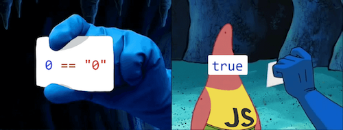
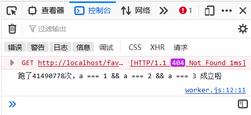

# JS 经典之眼见不一定为实



当 a 是什么的时候，下面的判断成立？

```javascript
const a = ?
if (a == 1 && a == 2 && a == 3) {
  console.log('true')
}
```

## 重写对象的 valueOf 方法

```javascript
const a = {
  i: 1,
  valueOf() { return this.i++ },
}
```

在 JavaScript 中，当一个对象和数字进行比较时，会发生类型转换，JavaScript 会尝试将对象转换为原始值。

首先，JavaScript 会调用对象的 `valueOf` 方法。如果该方法返回的是原始值，比较就会基于这个原始值进行。如果 `valueOf` 方法没有返回原始值（或者不是一个原始值），JavaScript 会继续调用对象的 `toString` 方法。最终，如果 toString 方法返回了原始值，比较将基于这个原始值进行。

如果 `valueOf` 和 `toString` 方法均未返回原始值，JavaScript 将抛出一个类型错误。

> [MDN](https://developer.mozilla.org/zh-CN/docs/Web/JavaScript/Reference/Global_Objects/Object/valueOf#%E6%8F%8F%E8%BF%B0): JavaScript 调用 `valueOf` 方法来将对象转换成基本类型值。

## 重写对象的 toString 方法

```javascript
const a = {
  i: 1,
  toString() { return this.i++ },
}
```

原理和上面的类似


## 替换数组的方法

```javascript
const a = [1, 2, 3]
a.join = c.shift
```

数组和数字比较，根据上面的逻辑，会先调用 `valueOf` 再调用数组的 `toString` 方法转换为原始值，而数组默认的 `toString` 会调用 `join` 方法，我们可以重写其中任意一个方法。

替换为 `shift` 后，每次比较就会从数组头部取出一个元素。

## Reflect.defineProperty

```javascript
globalThis._value = 1
Reflect.defineProperty(globalThis, 'a', {
  get() { return _value++ },
})
```

相信看过 Vue2 的响应式原理的应该对 `defineProperty` 不陌生，这里给全局 `this` 添加了一个 `get()` 方法，思路和第一二种是一致的

> [MDN - Object.defineProperty 介绍](https://developer.mozilla.org/zh-CN/docs/Web/JavaScript/Reference/Global_Objects/Object/defineProperty)
> [MDN](https://developer.mozilla.org/zh-CN/docs/Web/JavaScript/Reference/Global_Objects/Reflect/defineProperty): 静态方法 `Reflect.defineProperty()` 基本等同于 `Object.defineProperty()` 方法，唯一不同是返回 Boolean 值。

## Proxy 代理

```javascript
const a = new Proxy(
  { i: 1 },
  {
    get(target, p, receiver) {
      if (p === Symbol.toPrimitive) return () => target.i++
    },
  },
)
```

Vue3 的响应式就是基于 `Proxy` 的，思路和上面是一致的

> [MDN - Proxy 介绍](https://developer.mozilla.org/zh-CN/docs/Web/JavaScript/Reference/Global_Objects/Proxy)

## 多线程摸奖

```javascript
// main.js
const share = new SharedArrayBuffer(1)
new Worker('./competitors.js').postMessage(share)
new Worker('./competitors.js').postMessage(share)
new Worker('./competitors.js').postMessage(share)
new Worker('./worker.js').postMessage(share)
```

```javascript
// competitors.js
onmessage = ({ data }) => {
  const shareArr = new Uint8Array(data)
  setInterval(() => (shareArr[0] = Math.floor(Math.random() * 3) + 1))
}
```

```javascript
// worker.js
onmessage = ({ data }) => {
  const shareArr = new Uint8Array(data)
  Reflect.defineProperty(self, 'a', {
    get() { return shareArr[0] },
  })
  let count = 0
  while (!(a === 1 && a === 2 && a === 3)) count++
  console.log(`跑了${count}次，a === 1 && a === 2 && a === 3 成立啦`)
}
```

利用 `SharedArrayBuffer` 来在多个 `worker` 之间共享内存，其中三个随机设置 1-3 的值，另一个获取值并比较

浏览器对 `SharedArrayBuffer` 的限制比较严格，必须是安全上下文并开启跨域隔离才可以使用

```javascript
if(window.isSecureContext && window.crossOriginIsolated) {
  // 页面在安全上下文中并开启跨域隔离
} else {
  // ...
}
```

这个是最邪门的一个方式，至少在我电脑上跑了 41490778 次



> [MDN - SharedArrayBuffer 介绍](https://developer.mozilla.org/zh-CN/docs/Web/JavaScript/Reference/Global_Objects/SharedArrayBuffer)
> [MDN - 安全上下文](https://developer.mozilla.org/zh-CN/docs/Web/Security/Secure_Contexts)
> [MDN - 跨域隔离](https://developer.mozilla.org/zh-CN/docs/Web/API/crossOriginIsolated)
