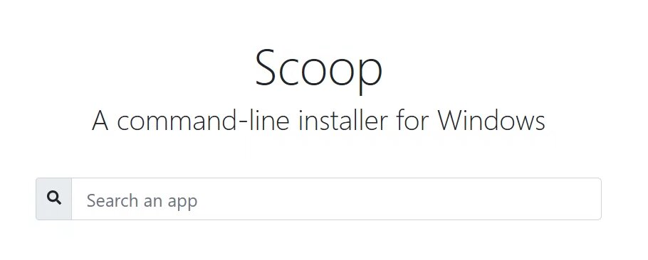

# 安装使用 Scoop



Windows 下管理软件的小工具。

举个例子，安装 tomcat：


更新软件：


## 安装和配置

### 安装

> 确保你能流畅访问 GitHub。
> **不要使用国内的一些 Gitee 的代理仓库安装主程序，问题很多！！！**

scoop 默认安装在 c 盘的 `~/scoop` 目录下，如果你想更改安装位置：
在 powershell 中输入：

```sh
$env:SCOOP='D:\scoop'
[Environment]::SetEnvironmentVariable('USERSCOOP', $env:SCOOP, 'User')
$env:SCOOP_GLOBAL='D:\scoop'
[Environment]::SetEnvironmentVariable('SCOOP_GLOBAL', $env:SCOOP_GLOBAL, 'Machine')
```

接下来安装主程序，在 powershell 中执行：

```sh
Set-ExecutionPolicy RemoteSigned -Scope CurrentUser
irm get.scoop.sh | iex
```

安装后的 scoop 文件夹会像这样：


安装完成没有报错后，执行第一次 update：

```sh
scoop update
```

你也可以先设置代理：

```sh
scoop config proxy localhost:7891
```

安装 aria2，提高下载速度，安装完会自动启用：

```sh
scoop install aria2
scoop config aria2-warning-enabled false
```

### 配置

scoop 默认启用了 main bucket，如果想添加其他官方源：

```sh
scoop bucket add extras
scoop bucket add java
scoop bucket add versions
```

以及我使用的第三方 bucket 也推荐给大家：

```sh
scoop bucket add dorado https://github.com/chawyehsu/dorado
```

## 基本使用

### 更新 scoop 和 bucket

```sh
scoop update
```

### 查看安装的软件

```sh
scoop list
```

### 搜索软件

```sh
scoop search <name>
```

### 安装软件

如果软件名没有冲突，bucket 可以省略

```sh
scoop install <bucket>/<name>
```

批量安装用空格分割，比如：

```sh
scoop install openjdk17 python go nodejs-lts
```

### 查看软件状态

```sh
scoop status
```

### 更新软件

```sh
scoop update <name> 或 scoop update *
```

### 清除下载缓存

scoop 安装完的安装包不会自动删除，在 scoop 目录下的 cache 文件夹。

你可以手动删除也可以运行：

```sh
scoop cache rm \*
```

### 清除旧版本

scoop 更新软件不会将旧版移除，只是将创建一个链接指向新版本。


不要手动删除旧版本，使用如下命令：

```sh
scoop cleanup <name> 或 scoop cleanup *
```

### 锁定版本

锁定指定软件版本，在 scoop update \* 时也不会更新。

#### 锁定

```sh
scoop hold <name>
```

#### 取消锁定

```sh
scoop unhold <name>
```

### 更多使用方法

```sh
scoop help
```


## 其他建议和说明

- 建议使用 scoop 安装纯命令行工具，如果你要安装图形化的软件，千万别安装浏览器。

- 不推荐安装 qq 微信钉钉什么的国产软件，确实是控制不了，scoop 的卸载没办法完全卸载它们。

- 如果图形化的软件，scoop 会在开始菜单放置一个目录。

- 在使用软件过程中，请使用 current 文件夹下的程序，比如 idea 中的 jdk 配置：
  

