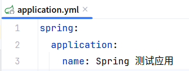
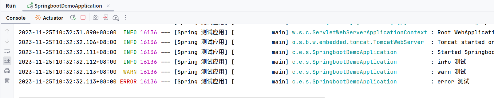
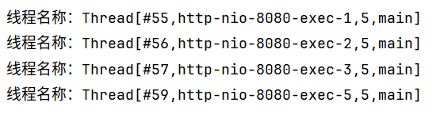
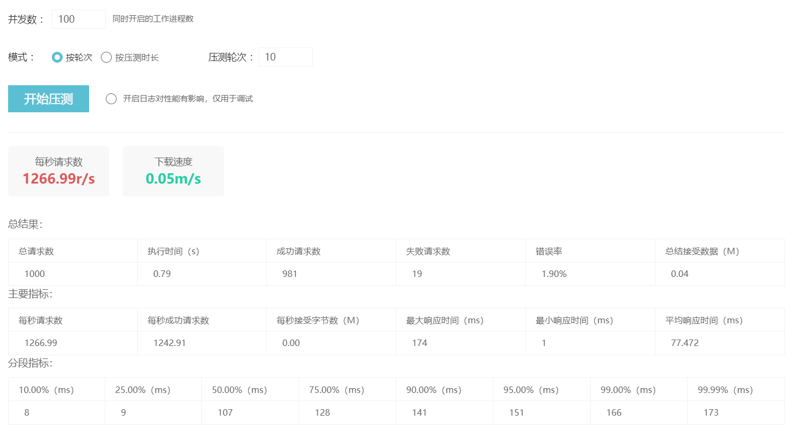
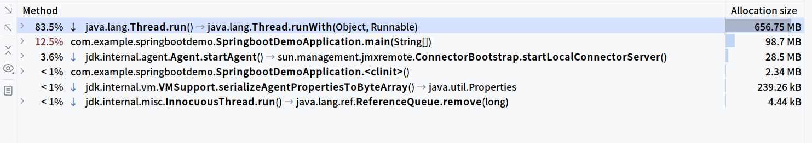
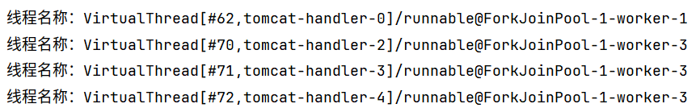
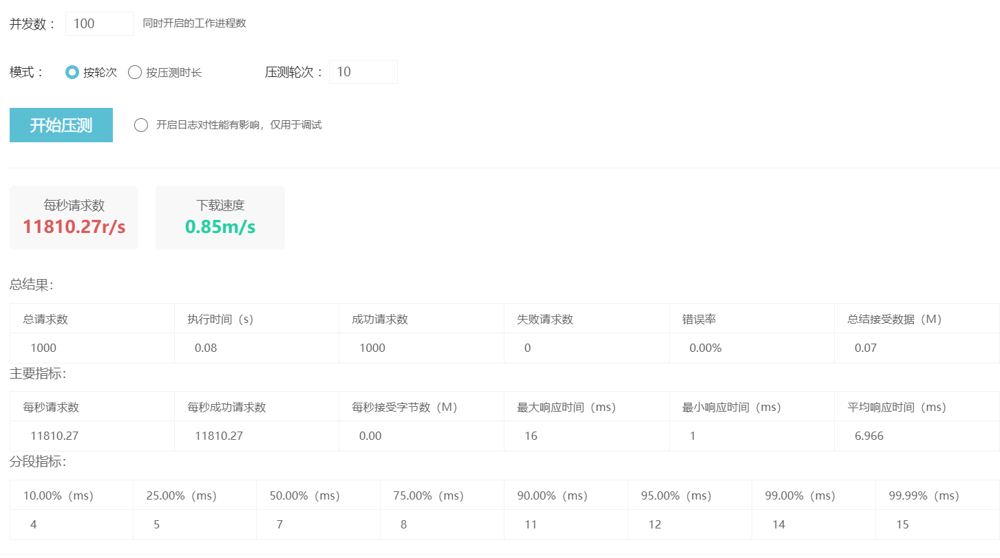
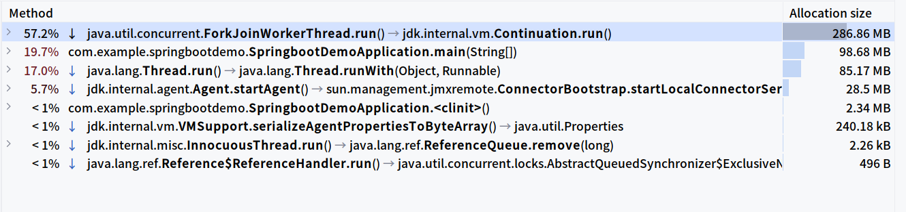
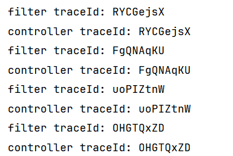

# SpringBoot 3.2 尝鲜



SpringBoot 已在 2023-11-23 正式发布，此版本支持了大量有用的新特性：

- 支持虚拟线程
- 对 JVM Checkpoint Restore （Project CRaC） 的初始支持
- SSL Bundle 重载
- 大量可观测性改进
- RestClient 的支持
- JdbcClient 的支持
- 支持 Jetty 12
- 支持 Spring for Apache Pulsar
- 对 Kafka 和 RabbitMQ 的 SSL 捆绑包支持
- 重新设计了嵌套 Jar 处理
- Docker 映像构建改进

> 以上内容翻译自[spring-boot-3-2-0-available-now](https://spring.io/blog/2023/11/23/spring-boot-3-2-0-available-now)

## 相比 3.1 的变化

- **日志输出包括应用程序名称**
  如果配置了 `spring.application.name`，默认日志输出将包括应用程序名称，可以将 `logging.include-application-name` 设置为 false 来关闭。
   

- **自动配置的 UserDetailsService**
  如果依赖中包含一个或多个 `spring-security-oauth2-client`、`spring-security-oauth2-resource-server`、`spring-security-saml2-service-provider`，将关闭 `InMemoryUserDetailsManager` 的自动配置 bean（在 `Reactive` 应用中为 `MapReactiveUserDetailsService`）。

  如果在使用上述依赖项之一，并且要使用 `InMemoryUserDetailsManager` 或 `MapReactiveUserDetailsService`，需要手动配置所需的 Bean。

- **OTLP Endpoint**
  默认的 `management.otlp.tracing.endpoint` 已被删除。 可设置 `management.otlp.tracing.endpoint` 为 `http://localhost:4318/v1/traces` 来恢复。

- **Jetty 12**
  Spring Boot 现在支持 `Jetty 12`。`Jetty 12` 支持 `Servlet 6.0 API`。

- **Kotlin 1.9.0**

- **嵌套 Jar**
  因为不再支持 Java 8，加载 Spring Boot 的 `Uber Jar` 底层代码已被重写。 以前的 URL 格式 `jar:file:/dir/myjar.jar:BOOT-INF/lib/nested.jar!/com/example/MyClass.class` 已替换为 `jar:nested:/dir/myjar.jar/!BOOT-INF/lib/nested.jar!/com/example/MyClass.class`。 更新后的代码还使用了 `java.lang.ref.Cleaner` （JDK 9 的一部分）用于资源管理。

> 以上内容翻译自[Spring-Boot-3.2-Release-note](https://github.com/spring-projects/spring-boot/wiki/Spring-Boot-3.2-Release-note)

## 新特性尝鲜

### 虚拟线程

#### 开启虚拟线程

虚拟线程的使用也非常简单，只需要在配置文件中开启，Spring Boot 会安排好一切，前提是 JDK 版本要大于等于 21。

```yml
spring:
  application:
    name: Spring 测试应用
  threads:
    virtual:
      # 开启虚拟线程支持
      enabled: true
```

开启后，Tomcat 等 Servlet 容器将自动使用虚拟线程。

#### 吞吐量测试

编写一个接口并来一次不严谨的测试。

```java
@GetMapping("/test")
public ResponseEntity<String> test() {
    var threadName = Thread.currentThread().toString();
    log.info("线程名称: {}", threadName);
    return ResponseEntity.ok(threadName);
}
```

不启用虚拟线程：

  

启用虚拟线程：

  

#### ThreadLocal 支持

比起性能，我更关心的是 `ThreadLocal` 能不能用 🧐，毕竟 `ThreadLocal` 是在单个操作系统线程中共享，多个虚拟线程很可能是同一个线程在执行。

写一个接口和过滤器来测试，这里直接用了 `slf4j` 的 `MDC` 了，Spring Boot 默认的 `logback` 就是用 `ThreaedLocal` 实现的。

```java
@Component
public class TraceIdFilter implements Filter {
    private final static Logger log = LoggerFactory.getLogger(SpringbootDemoApplication.class);

    @Override
    public void doFilter(ServletRequest request, ServletResponse response, FilterChain chain)
            throws IOException, ServletException {
        var traceId = RandomStringUtils.randomAlphabetic(8);
        log.info("filter traceId: {}", traceId);
        MDC.put("mdc-trace-id", traceId);
        chain.doFilter(request, response);
    }
}
```

```java
@GetMapping("/thread-local")
public ResponseEntity<String> threadLocal() {
    var traceId = MDC.get("mdc-trace-id");
    log.info("controller traceId: {}", traceId);
    return ResponseEntity.ok(traceId);
}
```

跑一下看看。



应该是没问题的 😆。

### RestClient

Spring 5 的时候，出了一个 `WebClient` 用于对 `RestTemplate` 的响应式包装，但 `WebClient` 需要响应式 web 才能用，所以 Spring 6.1 出了一个 `RestClient`，在非响应式 web 也能用，并且这个 `RestClient` 不使用 Servlet 线程，不会占用 Servlet 线程资源。

`RestClient` 的具体使用可以参考[官方文档](https://docs.spring.io/spring-framework/reference/integration/rest-clients.html)，这里给出一个简单的例子。

```java
@GetMapping("/rest-client")
public ResponseEntity<Object> restClient() {
    var restClient = RestClient.create();
    return restClient.get()
            .uri("https://api.github.com/users/{username}/repos", "FlapyPan")
            .accept(MediaType.APPLICATION_JSON)
            .acceptCharset(StandardCharsets.UTF_8)
            .retrieve()
            .toEntity(Object.class);
}
```

### JdbcClient

`JdbcClient` 是对 `JdbcTemplate` 的封装，更加简单方便，需要 `spring-boot-starter-jdbc` 依赖。

下面是一个增删改查的例子。

```java
public record Person(Integer id, String name, Instant createdAt) {
}
```

```java
@Repository
public class PersonRepository {
    private final JdbcClient jdbcClient;


    public PersonRepository(JdbcClient jdbcClient) {
        this.jdbcClient = jdbcClient;
    }

    public List<Person> findAll() {
        return jdbcClient
                .sql("select id, name, created_at from person")
                // 使用默认的 SimplePropertyRowMapper 进行映射，自动驼峰转换
                .query(Person.class)
                .list();
    }

    public Optional<Person> findById(Integer id) {
        return jdbcClient
                .sql("select id, name, created_at from person where id = :id")
                .param("id", id)
                .query(Person.class)
                .optional();
    }

    @Transactional
    public Integer save(Person person) {
        var keyHolder = new GeneratedKeyHolder();
        jdbcClient.sql("insert into person(id, name, created_at) values(:id, :name, :created_at) returning id")
                .param("id", person.id())
                .param("name", person.name())
                .param("created_at", person.createdAt())
                .update(keyHolder);
        return keyHolder.getKeyAs(Integer.class);
    }

    @Transactional
    public void update(Person person) {
        jdbcClient.sql("update person set name = :name, created_at = :created_at where id = :id)")
                .param("name", person.name())
                .param("created_at", person.createdAt())
                .param("id", person.id())
                .update();
    }

    @Transactional
    public void delete(Integer id) {
        jdbcClient.sql("update from person where id = :id)")
                .param("id", id)
                .update();
    }
}
```

```java
@RestController
@RequestMapping("/person")
public class PersonController {

    private final PersonRepository personRepository;

    public PersonController(PersonRepository personRepository) {
        this.personRepository = personRepository;
    }

    @GetMapping
    public ResponseEntity<List<Person>> getPersons() {
        return ResponseEntity.ok(personRepository.findAll());
    }

    @GetMapping("/{id}")
    public ResponseEntity<Person> getPersonById(@PathVariable Integer id) {
        return ResponseEntity.of(personRepository.findById(id));
    }

    @PostMapping
    public ResponseEntity<Integer> addPerson(@RequestBody Person person) {
        return ResponseEntity.ok(personRepository.save(person));
    }

    @PutMapping
    public ResponseEntity<?> modifyPerson(@RequestBody Person person) {
        personRepository.update(person);
        return ResponseEntity.ok().build();
    }

    @DeleteMapping("/{id}")
    public ResponseEntity<?> deletePersonById(@PathVariable Integer id) {
        personRepository.delete(id);
        return ResponseEntity.ok().build();
    }
}
```
