# 工具推荐

记录我电脑上必备的一些实用工具推荐，附上官方下载地址。

## 系统信息查看和优化

### AIDA64

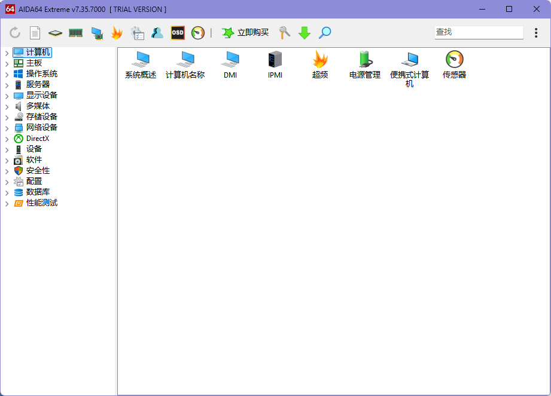

#### 下载安装

<https://www.aida64.com/downloads>

### Autoruns

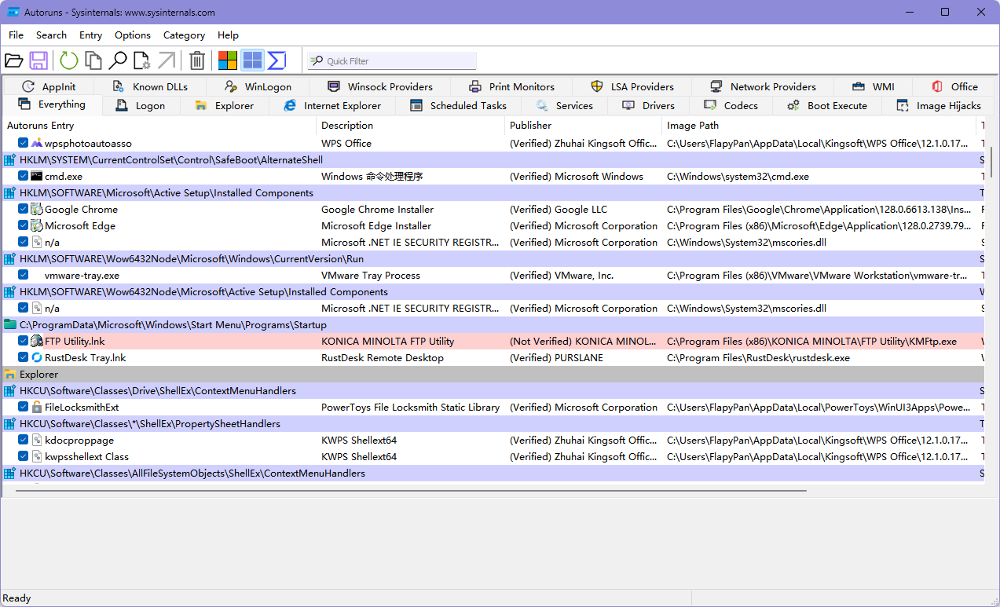

> 此实用工具对任何启动监视器的自动启动位置都有最全面的了解，它显示在系统启动或登录期间，以及在启动各种内置 Windows 应用（如 Internet Explorer、Explorer 和媒体播放器）时，配置为运行哪些程序。 这些程序和驱动程序包含在启动文件夹、Run、RunOnce 和其他注册表项中。 Autoruns 报告 Explorer 外壳扩展、工具栏、浏览器帮助程序对象、Winlogon 通知、自动启动服务等等。

#### 下载安装

微软官网安装：<https://learn.microsoft.com/zh-cn/sysinternals/downloads/autoruns#download>

### Defender Control

彻底关闭自带杀毒软件，win10、win11 都可用.

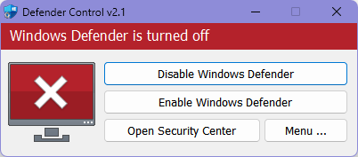

#### 下载安装

去 sordum 官网搜索下载，他们有很多实用小工具都可以去下载试试：<https://www.sordum.org/>

### Windows Update Blocker

关闭更新服务的工具。

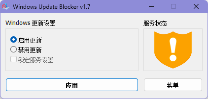

#### 下载安装

去 sordum 官网搜索下载，他们有很多实用小工具都可以去下载试试：<https://www.sordum.org/>

### DXVA Checker

检查支持的编解码器。

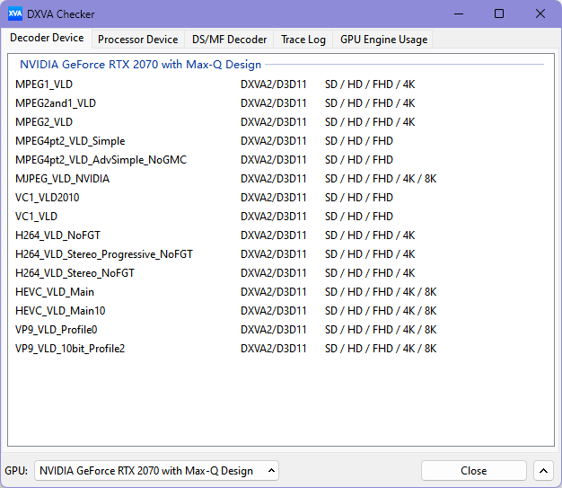

#### 下载安装

<https://bluesky-soft.com/en/DXVAChecker.html>

### NatTypeTester

检查当前网络的 nat 类型。

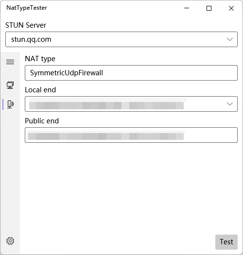

#### 源码仓库

<https://github.com/HMBSbige/NatTypeTester>

### noMeiryoUI

换字体。

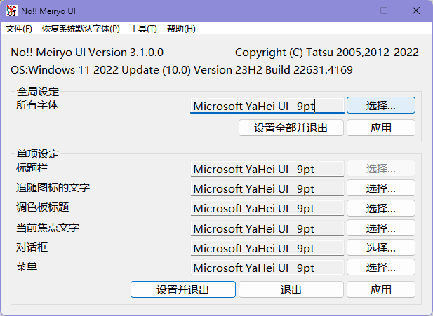

#### 源码仓库

<https://github.com/Tatsu-syo/noMeiryoUI>

### Optimizer

一些优化工具。

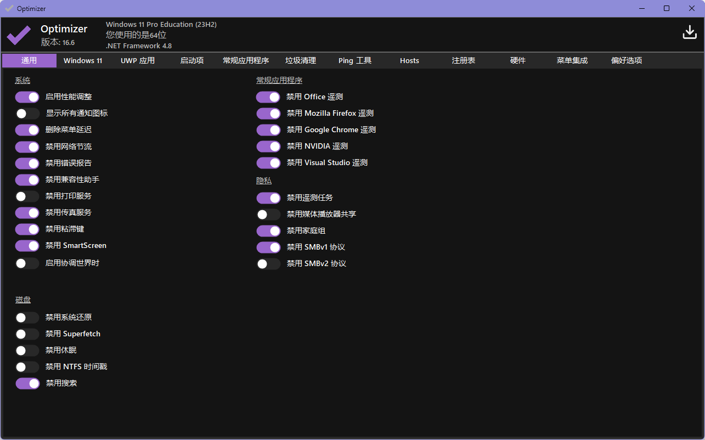

#### 源码仓库

<https://github.com/hellzerg/optimizer>

### ProcessExplorer

查看和管理进程的工具。

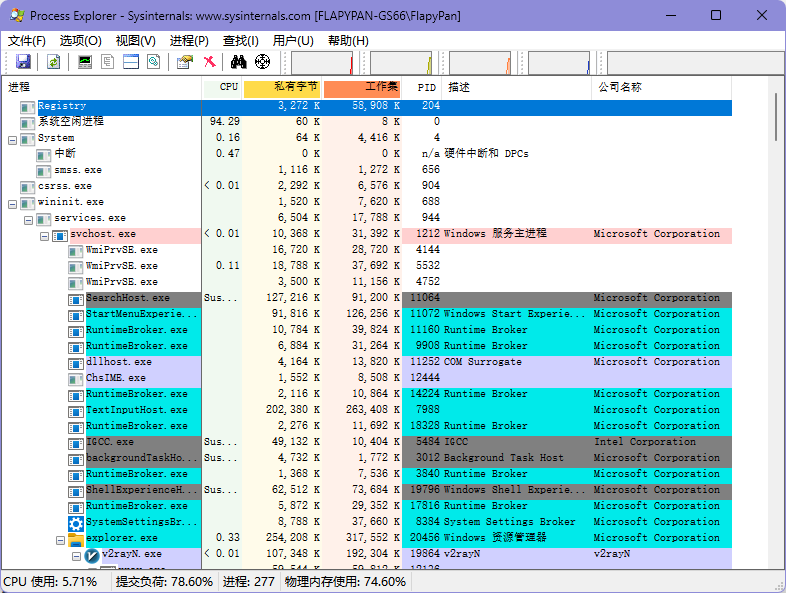

#### 下载安装

微软<https://learn.microsoft.com/zh-cn/sysinternals/downloads/process-explorer>

### PowerSettingsExplorer

调整电源配置的工具，可以调整大小核心优先度。

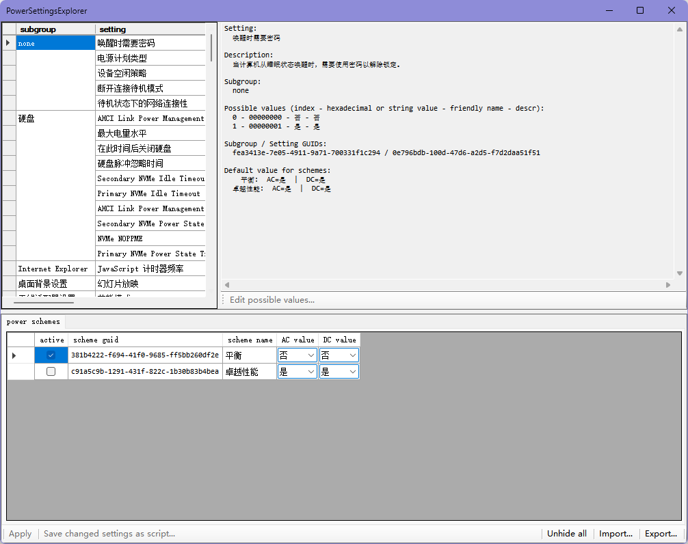

#### 下载安装

~~坏了，我自己都找不到在哪下的了，有需要的可以联系我。~~

### Runasdate

伪装日期时间运行程序，可能对一些限时试用软件有奇效？

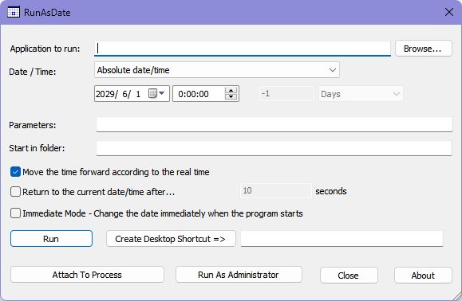

#### 下载安装

<https://www.nirsoft.net/utils/run_as_date.html>

### Windows11Manager

一些优化工具。

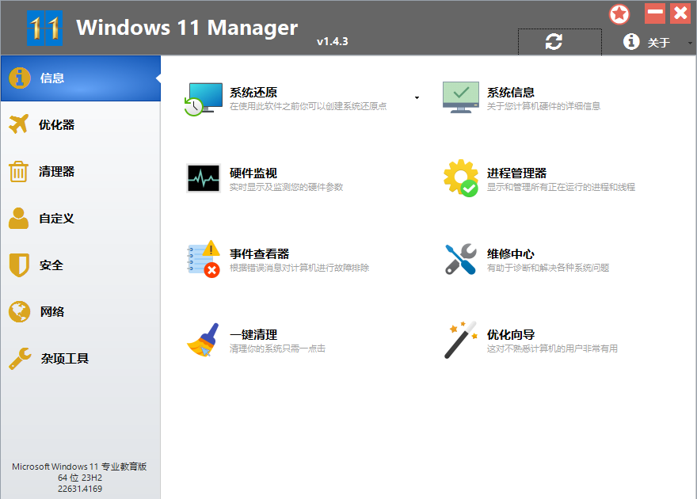

#### 下载安装

<https://www.yamicsoft.com/cn/index.html>

### CompactGUI

Windows Compact 功能的图形化工具。

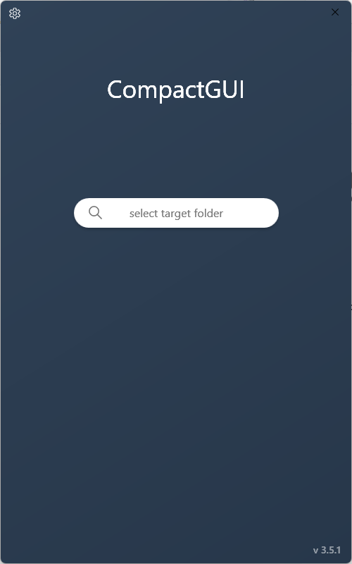

#### 源码仓库

<https://github.com/IridiumIO/CompactGUI>

### ContextMenuManager

右键菜单管理工具。

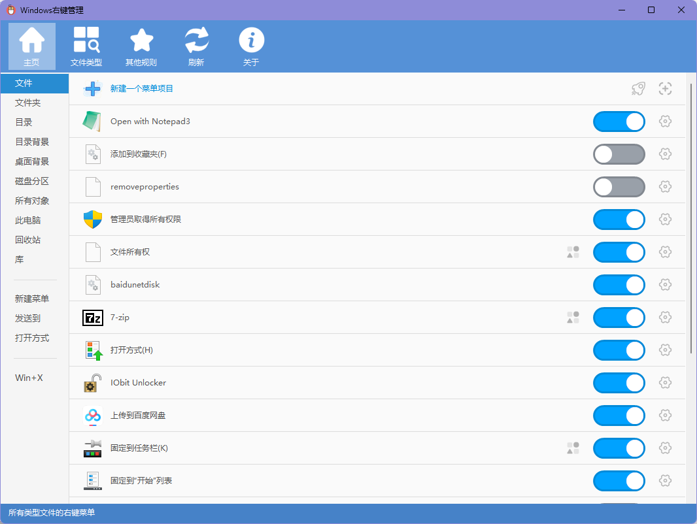

#### 仓库地址

<https://github.com/BluePointLilac/ContextMenuManager>

### InSpectre

幽灵漏洞修复微码的开启和关闭工具。

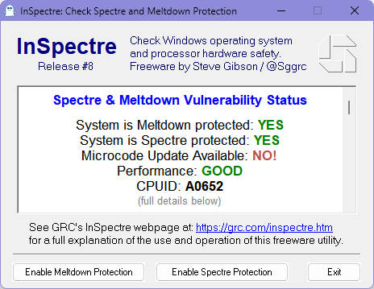

#### 下载安装

<https://www.grc.com/inspectre.htm>

### 软件屏蔽器 MWP

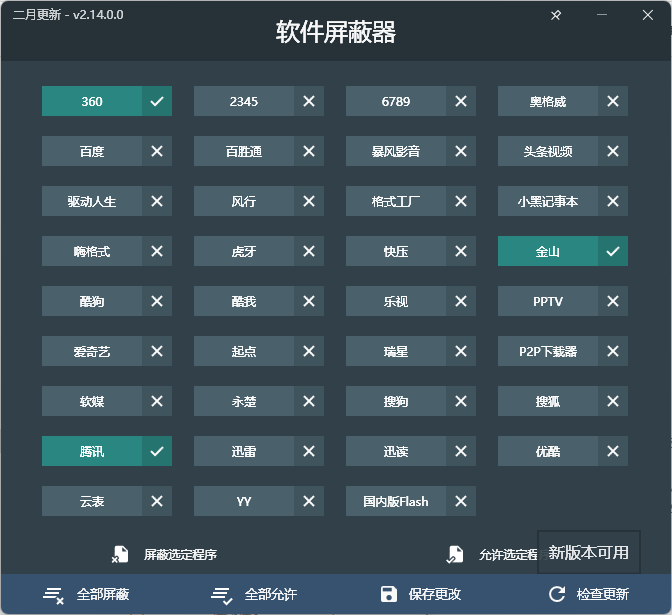

#### 源码仓库

<https://github.com/the1812/Malware-Patch>

### TCPOptimizer

网络优化工具。

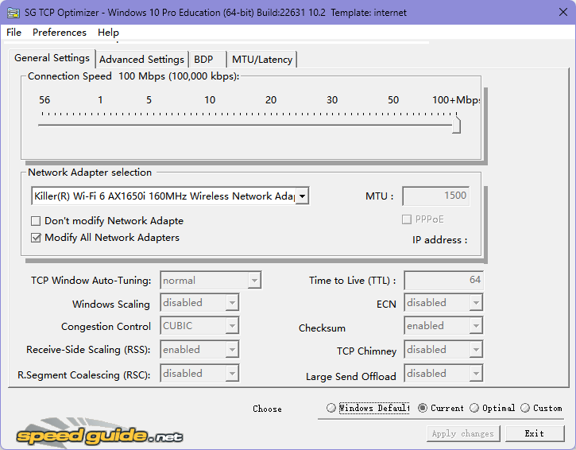

#### 下载安装

<https://www.speedguide.net/downloads.php>

## 磁盘和PE工具

### Ventoy

非常好 PE 工具，使我的 ISO 旋转。

~~想起我在机房用这个玩意装系统的日子了~~

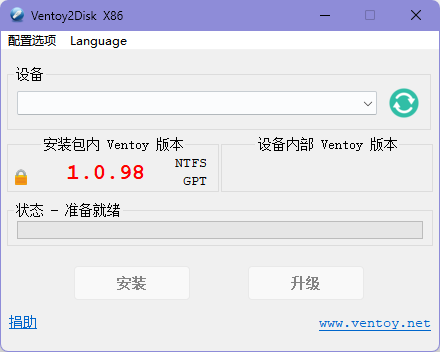

#### 下载安装

<https://www.ventoy.net/cn/download.html>

### Bootice64

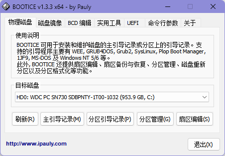

#### 下载安装

<https://www.majorgeeks.com/files/details/bootice_64_bit.html>

### CrystalDiskInfo

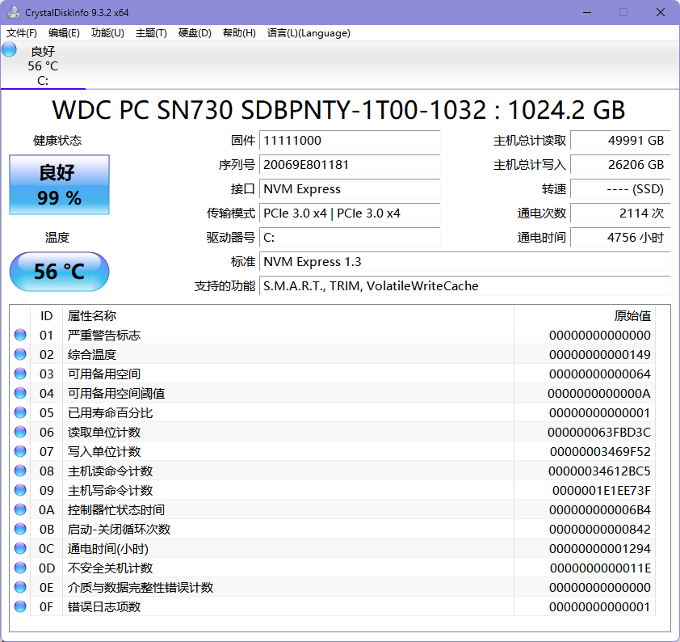

#### 下载安装

<https://crystalmark.info/en/software/crystaldiskinfo/>

## 卸载和清理工具

### Bulk Crap Uninstaller (BCU)

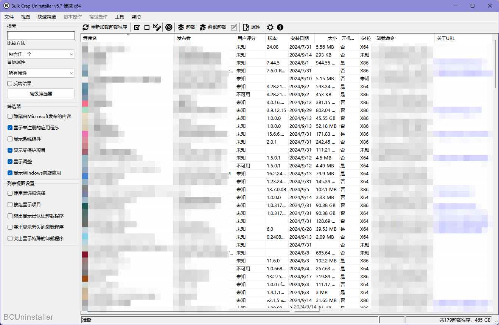

#### 下载安装

<https://www.bcuninstaller.com/>

### Geek Uninstaller

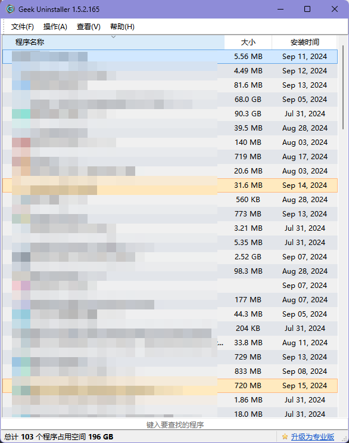

#### 下载安装

<https://geekuninstaller.com/download>

### Dism++

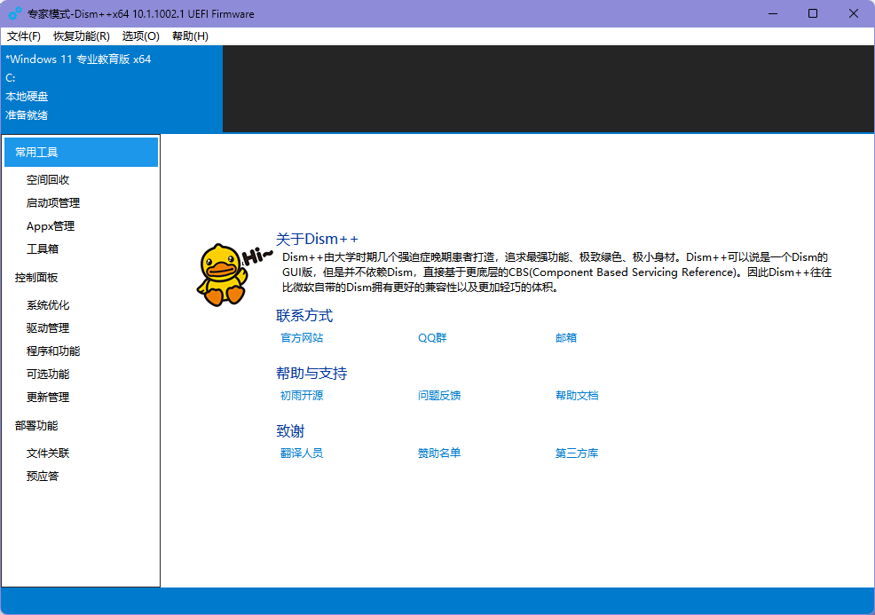

#### 源码仓库

<https://github.com/Chuyu-Team/Dism-Multi-language>

## 娱乐

### CentBrowser (4.1.7.182)

这个版本(4.1.7.182)附带了 Flash 插件，可以玩一些老的 4399 小游戏，推荐用便携版。

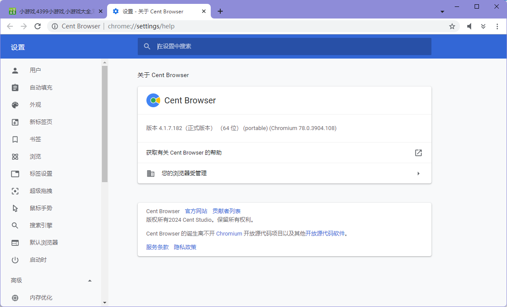

#### 下载安装

<https://www.centbrowser.com/history.html#4.1.7.182>

## 其他

### TorBrowser

都懂。
